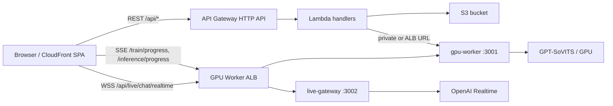

# Lambda Serverless Backend + GPU Worker Guide

Last updated: 2026-04-27

This guide explains the new deployment shape:

- React SPA: S3 + CloudFront
- REST backend: AWS Lambda + API Gateway HTTP API
- GPU work: existing GPU EC2, still running `gpu-worker` on port `3001`
- Live chatbot WebSocket: new `live-gateway` process on the GPU EC2, normally behind the same ALB on port `3002`
- Storage handoff: S3

AWS references worth keeping open:

- Lambda VPC access: https://docs.aws.amazon.com/lambda/latest/dg/configuration-vpc.html
- Lambda VPC internet/S3 access note: https://docs.aws.amazon.com/lambda/latest/dg/configuration-vpc-internet.html
- SAM deploy: https://docs.aws.amazon.com/serverless-application-model/latest/developerguide/using-sam-cli-deploy.html
- API Gateway HTTP API integration timeout: https://docs.aws.amazon.com/apigateway/latest/developerguide/http-api-quotas.html
- Lambda proxy binary responses: https://docs.aws.amazon.com/apigateway/latest/developerguide/lambda-proxy-binary-media.html

## What Changed In The Repo

New top-level packages:

- `lambda/`
  - SAM template and Node.js Lambda handlers for REST routes.
  - Handles config, uploads, model listing/loading, training start/stop/current, inference start/result/current/status/stop, transcription, training-audio browsing, and fast live phrase TTS.
- `live-gateway/`
  - Standalone Express + `ws` process that owns `/api/live/chat/realtime`.
  - Reuses the existing OpenAI Realtime bridge logic from the old backend.

GPU worker changes:

- `GET /train/current`
- `POST /inference`
- `POST /inference/generate`
- `GET /inference/progress/:sessionId`
- `POST /inference/cancel`
- `GET /inference/current`
- S3 upload helper for generated final WAVs
- CORS controlled by `CORS_ORIGIN`

Frontend changes:

- `VITE_API_BASE_URL`: API Gateway REST origin
- `VITE_GPU_WORKER_URL`: GPU worker ALB origin for SSE
- `VITE_LIVE_GATEWAY_URL`: optional separate live WebSocket origin

## Traffic Flow



## GPU EC2 Setup

Run the existing GPU worker:

```bash
cd /opt/VoiceCloning/gpu-worker
npm install
GPT_SOVITS_ROOT=/opt/gpt-sovits \
WORKER_HOST=0.0.0.0 \
WORKER_PORT=3001 \
INFERENCE_HOST=127.0.0.1 \
INFERENCE_PORT=9880 \
S3_BUCKET=interns2026-small-projects-bucket-shared \
S3_REGION=ap-southeast-1 \
S3_PREFIX=echolect/ \
CORS_ORIGIN=https://YOUR_CLOUDFRONT_DOMAIN \
npm start
```

Run the live gateway as a second process:

```bash
cd /opt/VoiceCloning/live-gateway
npm install
NODE_ENV=production \
PORT=3002 \
CORS_ORIGIN=https://YOUR_CLOUDFRONT_DOMAIN \
OPENAI_API_KEY=sk-... \
OPENAI_REALTIME_MODEL=gpt-realtime \
OPENAI_REALTIME_VAD=semantic_vad \
OPENAI_REALTIME_SYSTEM_PROMPT="You are a casual, helpful assistant. Keep replies concise and conversational. Always respond only in English." \
npm start
```

Recommended `pm2` setup:

```bash
pm2 start /opt/VoiceCloning/gpu-worker/src/index.js --name voice-gpu-worker --cwd /opt/VoiceCloning/gpu-worker
pm2 start /opt/VoiceCloning/live-gateway/src/index.js --name voice-live-gateway --cwd /opt/VoiceCloning/live-gateway
pm2 save
```

## ALB Routing

Put HTTPS in front of the GPU EC2. Two common options:

1. One ALB with path-based routing:
   - `/api/live/chat/realtime` -> target group port `3002`
   - `/train/progress/*` -> target group port `3001`
   - `/inference/progress/*` -> target group port `3001`
   - `/healthz` -> target group port `3001`

2. Two origins/domains:
   - `https://gpu-worker.example.com` -> port `3001`
   - `https://live-gateway.example.com` -> port `3002`

For option 1:

```env
VITE_GPU_WORKER_URL=https://gpu-worker.example.com
# VITE_LIVE_GATEWAY_URL can be omitted
```

For option 2:

```env
VITE_GPU_WORKER_URL=https://gpu-worker.example.com
VITE_LIVE_GATEWAY_URL=https://live-gateway.example.com
```

## Lambda Deployment

Install dependencies and build:

```bash
cd lambda
npm install
sam build --template template.yaml
```

Deploy when the GPU worker is reachable through a public/internal ALB URL:

```bash
sam deploy \
  --stack-name voice-cloning-api \
  --capabilities CAPABILITY_IAM \
  --parameter-overrides \
    S3Bucket=interns2026-small-projects-bucket-shared \
    S3Region=ap-southeast-1 \
    S3Prefix=echolect/ \
    GpuWorkerUrl=https://YOUR_GPU_WORKER_ALB_DOMAIN \
    GpuWorkerPublicUrl=https://YOUR_GPU_WORKER_ALB_DOMAIN \
    ModelSource=gpu-worker \
    ArtifactSource=s3 \
    CorsOrigin=https://YOUR_CLOUDFRONT_DOMAIN
```

Deploy when Lambda must call the GPU EC2 private IP:

```bash
sam deploy \
  --stack-name voice-cloning-api \
  --capabilities CAPABILITY_IAM \
  --parameter-overrides \
    S3Bucket=interns2026-small-projects-bucket-shared \
    S3Region=ap-southeast-1 \
    S3Prefix=echolect/ \
    GpuWorkerUrl=http://10.0.2.25:3001 \
    GpuWorkerPublicUrl=https://YOUR_GPU_WORKER_ALB_DOMAIN \
    ModelSource=gpu-worker \
    ArtifactSource=s3 \
    CorsOrigin=https://YOUR_CLOUDFRONT_DOMAIN \
    VpcSubnetIds=subnet-aaa,subnet-bbb \
    VpcSecurityGroupIds=sg-lambda
```

If Lambda is VPC-attached, make sure it can still reach S3. Use either:

- NAT Gateway / NAT instance for outbound internet access
- S3 Gateway VPC Endpoint for private S3 access

Security groups:

- Lambda security group outbound -> GPU worker security group TCP `3001`
- GPU worker security group inbound from Lambda security group TCP `3001`
- ALB security group inbound HTTPS `443` from users
- GPU worker security group inbound from ALB security group TCP `3001` and `3002`

## Frontend Deployment

Create or update the frontend production env:

```env
VITE_API_BASE_URL=https://YOUR_API_ID.execute-api.YOUR_REGION.amazonaws.com
VITE_GPU_WORKER_URL=https://YOUR_GPU_WORKER_ALB_DOMAIN
# Optional only if live gateway has a separate origin:
# VITE_LIVE_GATEWAY_URL=https://YOUR_LIVE_GATEWAY_DOMAIN
VITE_APP_BASENAME=/
```

Build and upload:

```bash
cd client
npm install
npm run build
aws s3 sync dist/ s3://YOUR_FRONTEND_BUCKET/ --delete
aws cloudfront create-invalidation --distribution-id YOUR_DISTRIBUTION_ID --paths "/*"
```

## Local Testing Without SAM

You can test the Lambda migration locally with four terminals. This does not require SAM CLI. It still uses real S3, so your shell must have AWS credentials that can read/write the configured bucket.

First create `lambda/local.env`:

```bash
cd lambda
cp local.env.example local.env
```

Edit `lambda/local.env` if your bucket, prefix, region, or GPU worker URL differ:

```env
PORT=3000
S3_BUCKET=interns2026-small-projects-bucket-shared
S3_REGION=ap-southeast-1
S3_PREFIX=echolect/
GPU_WORKER_URL=http://localhost:3001
GPU_WORKER_PUBLIC_URL=http://localhost:3001
CORS_ORIGIN=http://localhost:5173
MODEL_SOURCE=gpu-worker
ARTIFACT_SOURCE=gpu-worker
```

`MODEL_SOURCE=gpu-worker` makes local `/api/models` read GPT and SoVITS checkpoints from the GPU worker's `GPT_SOVITS_ROOT` instead of S3. The SAM template also defaults `ModelSource` to `gpu-worker`; set `ModelSource=s3` only if you want the old S3 model-list behavior.

`ARTIFACT_SOURCE=gpu-worker` makes local `/api/training-audio/...` and `/api/inference/result/...` return URLs served by the GPU worker instead of presigned S3 URLs. For deployed Lambda, keep `ArtifactSource=s3` when you want generated audio and training audio persisted through S3; use `ArtifactSource=gpu-worker` only if the browser can reach `GpuWorkerPublicUrl`.

Terminal 1: GPU worker REST/SSE service:

```bash
cd gpu-worker
npm install
$env:GPT_SOVITS_ROOT="C:\path\to\GPT-SoVITS"
$env:S3_BUCKET="interns2026-small-projects-bucket-shared"
$env:S3_REGION="ap-southeast-1"
$env:S3_PREFIX="echolect/"
$env:CORS_ORIGIN="http://localhost:5173"
npm run dev
```

Terminal 2: Live WebSocket gateway:

```bash
cd live-gateway
npm install
$env:OPENAI_API_KEY="sk-..."
$env:CORS_ORIGIN="http://localhost:5173"
$env:PORT="3002"
npm run dev
```

Terminal 3: Lambda-local REST shim:

```bash
cd lambda
npm install
npm run dev
```

Terminal 4: React app in Lambda-local mode:

```bash
cd client
npm install
npm run dev:lambda
```

Then open `http://localhost:5173`.

Local URL map:

- REST API: `http://localhost:3000/api/*`
- GPU Worker SSE: `http://localhost:3001/train/progress/*` and `http://localhost:3001/inference/progress/*`
- Live chatbot WebSocket: `ws://localhost:3002/api/live/chat/realtime`
- Frontend: `http://localhost:5173`

Quick checks:

```bash
curl http://localhost:3000/api/config
curl http://localhost:3001/healthz
curl http://localhost:3002/healthz
```

Expected:

- Lambda-local config returns `{"storageMode":"s3","inferenceMode":"remote"}`
- GPU worker health returns `service: "gpu-worker"`
- Live gateway health returns `service: "voice-cloning-live-gateway"`

## Smoke Tests

REST through Lambda:

```bash
API=https://YOUR_API_ID.execute-api.YOUR_REGION.amazonaws.com
curl "$API/api/config"
curl "$API/api/models"
curl "$API/api/train/current"
curl "$API/api/inference/current"
curl "$API/api/inference/status"
```

Expected:

- `/api/config` returns `{"storageMode":"s3","inferenceMode":"remote"}`
- current-state endpoints return JSON, even when idle
- `/api/models` returns S3-backed `gpt` and `sovits` arrays

GPU worker direct:

```bash
GPU=https://YOUR_GPU_WORKER_ALB_DOMAIN
curl "$GPU/healthz"
curl "$GPU/train/current"
curl "$GPU/inference/current"
```

Live gateway:

```bash
LIVE=https://YOUR_LIVE_GATEWAY_OR_GPU_ALB_DOMAIN
curl "$LIVE/healthz"
```

Browser network checks:

- Normal REST calls go to API Gateway.
- Training SSE goes to `VITE_GPU_WORKER_URL/train/progress/<sessionId>`.
- Inference SSE goes to `VITE_GPU_WORKER_URL/inference/progress/<sessionId>`.
- Live chatbot WebSocket goes to `wss://.../api/live/chat/realtime`.
- Fast phrase TTS calls `POST /api/live/tts-sentence` on API Gateway and receives `audio/wav`.

## Important Limits

API Gateway HTTP APIs have a 30-second maximum integration timeout. Long inference should use:

- `POST /api/inference/generate`
- direct browser SSE to `/inference/progress/:sessionId`
- `GET /api/inference/result/:sessionId`

`POST /api/inference` is still present for compatibility with Live Full and short direct synthesis, but long text should prefer the streaming flow.

API Gateway WebSocket Lambda integrations are per-message and do not let Lambda own a raw long-lived socket. That is why `/api/live/chat/realtime` runs in `live-gateway` on the GPU EC2 instead of Lambda.
