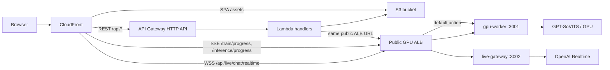

# Lambda Serverless Backend + GPU Worker Guide

Last updated: 2026-04-28

This guide explains the new deployment shape:

- React SPA: S3 + CloudFront
- REST backend: AWS Lambda + API Gateway HTTP API
- GPU work: existing GPU EC2, still running `gpu-worker` on port `3001`
- Live chatbot WebSocket: `live-gateway` process on the same GPU EC2, running on port `3002`
- Current test networking target: one public GPU ALB; ALB default action goes to `gpu-worker:3001`, and only `/api/live/chat/realtime` path-routes to `live-gateway:3002`
- Storage handoff: S3

Current known AWS resources:

- GPU EC2: g6 instance in Seoul, running GPT-SoVITS, `gpu-worker`, and `live-gateway`.
- GPU VPC: `VoiClo-Gpu-Seoul-vpc` (`vpc-0b81d044238fcee4d`) in `ap-northeast-2`.
- Public subnets in the GPU VPC:
  - `VoiClo-Gpu-Seoul-subnet-public1-ap-northeast-2a`
  - `VoiClo-Gpu-Seoul-subnet-public2-ap-northeast-2b`
- Internet gateway: `VoiClo-Gpu-Seoul-igw`.
- Public route table: `VoiClo-Gpu-Seoul-rtb-public` (`rtb-0d344d2f505e5d660`).
- GPU ALB: `voice-gpu-alb`, internet-facing, IPv4, HTTP listener on port `80`.
- GPU ALB DNS: `voice-gpu-alb-815777974.ap-northeast-2.elb.amazonaws.com`.
- GPU security group: `VoiClo-Gpu-Seoul-SG` (`sg-0806b2491f69f242e`).
- Current GPU target group: `voice-gpu-worker`, instance target, HTTP port `3001`.
- Current gap: create a second target group for `live-gateway` on HTTP port `3002`, then add the `/api/live/chat/realtime` ALB listener rule.
- Frontend S3 bucket: `interns2026-small-projects-bucket-shared`, under prefix `echolect/dist/`.
- CloudFront distribution ID: `E2KTGN0G56FW71`.

AWS references worth keeping open:

- Lambda VPC access: https://docs.aws.amazon.com/lambda/latest/dg/configuration-vpc.html
- Lambda VPC internet/S3 access note: https://docs.aws.amazon.com/lambda/latest/dg/configuration-vpc-internet.html
- SAM deploy: https://docs.aws.amazon.com/serverless-application-model/latest/developerguide/using-sam-cli-deploy.html
- API Gateway HTTP API integration timeout: https://docs.aws.amazon.com/apigateway/latest/developerguide/http-api-quotas.html
- Lambda proxy binary responses: https://docs.aws.amazon.com/apigateway/latest/developerguide/lambda-proxy-binary-media.html

## What Changed In The Repo

New top-level packages:

- `lambda/`
  - SAM template and Node.js Lambda handlers for REST routes.
  - Handles config, uploads, model listing/loading, training start/stop/current, inference start/result/current/status/stop, transcription, training-audio browsing, and fast live phrase TTS.
- `live-gateway/`
  - Standalone Express + `ws` process that owns `/api/live/chat/realtime`.
  - Reuses the existing OpenAI Realtime bridge logic from the old backend.

GPU worker changes:

- `GET /train/current`
- `POST /inference`
- `POST /inference/generate`
- `GET /inference/progress/:sessionId`
- `POST /inference/cancel`
- `GET /inference/current`
- S3 upload helper for generated final WAVs
- CORS controlled by `CORS_ORIGIN`

Frontend changes:

- `VITE_API_BASE_URL`: REST API origin; in deployed CloudFront testing, use the CloudFront domain because `/api/*` is proxied to API Gateway
- `VITE_GPU_WORKER_URL`: browser-facing origin for SSE and WebSocket path routing; with CloudFront behaviors, use the CloudFront domain, not the raw HTTP ALB URL
- `VITE_LIVE_GATEWAY_URL`: normally omitted; only set this if live-gateway uses a different public origin

## Traffic Flow



## GPU EC2 Setup

Run the existing GPU worker from the GitHub clone under the `ubuntu` user. In the current test setup, this is the ALB default target on port `3001`:

```bash
cd ~/VoiceCloning/gpu-worker
npm install
GPT_SOVITS_ROOT=/opt/gpt-sovits \
PYTHON_EXEC=/opt/gpt-sovits/venv/bin/python \
WORKER_HOST=0.0.0.0 \
WORKER_PORT=3001 \
INFERENCE_HOST=127.0.0.1 \
INFERENCE_PORT=9880 \
S3_BUCKET=interns2026-small-projects-bucket-shared \
S3_REGION=ap-southeast-1 \
S3_PREFIX=echolect/ \
CORS_ORIGIN=https://YOUR_CLOUDFRONT_DOMAIN \
npm start
```

The deployment env file for `gpu-worker.service` should contain:

```env
WORKER_HOST=0.0.0.0
WORKER_PORT=3001
GPT_SOVITS_ROOT=/opt/gpt-sovits
PYTHON_EXEC=/opt/gpt-sovits/venv/bin/python
INFERENCE_HOST=127.0.0.1
INFERENCE_PORT=9880
S3_BUCKET=interns2026-small-projects-bucket-shared
S3_REGION=ap-southeast-1
S3_PREFIX=echolect/
CORS_ORIGIN=https://d3dghqhnk7aoku.cloudfront.net
```

GPT-SoVITS itself runs separately on the same EC2:

```bash
cd /opt/gpt-sovits
. venv/bin/activate
python api_v2.py
```

Run the live gateway as a second process on the same GPU EC2. This process owns OpenAI Realtime and the browser WebSocket; `gpu-worker` itself does not talk to OpenAI Realtime:

```bash
cd ~/VoiceCloning/live-gateway
npm install
NODE_ENV=production \
PORT=3002 \
CORS_ORIGIN=https://YOUR_CLOUDFRONT_DOMAIN \
OPENAI_API_KEY=sk-... \
OPENAI_REALTIME_MODEL=gpt-realtime \
OPENAI_REALTIME_VAD=semantic_vad \
OPENAI_REALTIME_SYSTEM_PROMPT="You are a casual, helpful assistant. Keep replies concise and conversational. Always respond only in English." \
npm start
```

The deployment env file for `live-gateway.service` should contain:

```env
NODE_ENV=production
PORT=3002
CORS_ORIGIN=https://d3dghqhnk7aoku.cloudfront.net
OPENAI_API_KEY=
OPENAI_REALTIME_MODEL=gpt-realtime
OPENAI_REALTIME_VAD=semantic_vad
OPENAI_REALTIME_SYSTEM_PROMPT="You are a casual, helpful assistant. Keep replies concise and conversational. Always respond only in English."
```

Recommended `systemd` setup:

```ini
# /etc/systemd/system/gpu-worker.service
[Unit]
Description=Voice Cloning GPU Worker
After=network.target

[Service]
Type=simple
WorkingDirectory=/home/ubuntu/VoiceCloning/gpu-worker
EnvironmentFile=/home/ubuntu/VoiceCloning/gpu-worker/.env
ExecStart=/usr/bin/npm start
Restart=always
RestartSec=5
User=ubuntu

[Install]
WantedBy=multi-user.target
```

```ini
# /etc/systemd/system/live-gateway.service
[Unit]
Description=Voice Cloning Live Gateway
After=network.target

[Service]
Type=simple
WorkingDirectory=/home/ubuntu/VoiceCloning/live-gateway
EnvironmentFile=/home/ubuntu/VoiceCloning/live-gateway/.env
ExecStart=/usr/bin/npm start
Restart=always
RestartSec=5
User=ubuntu

[Install]
WantedBy=multi-user.target
```

```bash
sudo systemctl daemon-reload
sudo systemctl enable --now gpu-worker
sudo systemctl enable --now live-gateway
sudo systemctl status gpu-worker
sudo systemctl status live-gateway
```

## ALB Routing

Current test setup uses one public ALB in front of the GPU EC2.

The ALB is in the same Seoul VPC as the GPU EC2. The AWS console shows the ALB mapped across two availability zones, so it should be attached to both public subnets:

- `VoiClo-Gpu-Seoul-subnet-public1-ap-northeast-2a`
- `VoiClo-Gpu-Seoul-subnet-public2-ap-northeast-2b`

The GPU EC2 itself is in `VoiClo-Gpu-Seoul-subnet-public1-ap-northeast-2a`.

Two ALB subnets is expected. Application Load Balancers are designed to span at least two availability zones for availability. The ALB can still route to a single GPU EC2 target in one subnet; the second subnet is for ALB nodes, not a requirement that the app has two GPU instances.

### ALB Target Groups

Create or confirm these target groups:

| Target group | Target | Port | Health check |
| --- | --- | ---: | --- |
| `voice-gpu-worker` | GPU EC2 instance | `3001` | `GET /healthz` |
| `voice-live-gateway` | same GPU EC2 instance | `3002` | `GET /healthz` |

Current screenshot state:

- `voice-gpu-worker` already exists and points to port `3001`.
- Its target is currently `Unused: Target is in the stopped state` because the EC2 instance was stopped when the screenshot was taken. This should become healthy after the GPU EC2 and `gpu-worker.service` are running.
- `voice-live-gateway` still needs to be created and registered on port `3002`.

### ALB Listener Rules

Use one HTTP listener on port `80` while testing. Later, add HTTPS on port `443` if you attach a certificate directly to the ALB.

| Priority | Condition | Action |
| ---: | --- | --- |
| `1` | Path is `/api/live/chat/realtime` | Forward to `voice-live-gateway` |
| default | Everything else | Forward to `voice-gpu-worker` |

Do not add ALB rules for `/train/progress/*`, `/inference/progress/*`, `/models`, `/healthz`, or `/training-audio/*`. Those should hit the default `gpu-worker:3001` target group.

Lambda can call the public ALB URL directly:

```text
GpuWorkerUrl=http://voice-gpu-alb-815777974.ap-northeast-2.elb.amazonaws.com
```

The browser should use the HTTPS CloudFront domain when CloudFront is routing SSE/WSS to that ALB origin:

```env
VITE_GPU_WORKER_URL=https://d3dghqhnk7aoku.cloudfront.net
# Optional only if live gateway has a separate origin:
# VITE_LIVE_GATEWAY_URL=https://YOUR_LIVE_GATEWAY_DOMAIN
```

The browser derives the live WebSocket URL from `VITE_GPU_WORKER_URL`, so it connects to:

```text
wss://d3dghqhnk7aoku.cloudfront.net/api/live/chat/realtime
```

CloudFront can also use the same GPU ALB origin for SSE and WSS. Configure behaviors in this order:

- `/api/live/chat/realtime` -> GPU ALB origin, caching disabled, WebSocket upgrade headers forwarded
- `/train/progress/*` -> GPU ALB origin, caching disabled
- `/inference/progress/*` -> GPU ALB origin, caching disabled
- `/api/*` -> API Gateway origin
- default `/*` -> S3 SPA origin

The `/api/live/chat/realtime` behavior must have higher priority than `/api/*`; otherwise CloudFront may send the WebSocket request to API Gateway or the SPA fallback.

The live-gateway target group can still health check `GET /healthz` on port `3002`; this does not require exposing `/healthz` through a public ALB listener rule.

Current security group note: `sg-0806b2491f69f242e` is used for the GPU EC2 and ALB right now. This works for testing, but split it later into a dedicated ALB security group and a dedicated GPU EC2 security group:

- ALB SG inbound: HTTP `80` from CloudFront/browser while testing; later HTTPS `443`.
- GPU EC2 SG inbound: TCP `3001` and `3002` only from the ALB SG.
- Do not leave direct public inbound access to `3001`, `3002`, or `9880` in production.

## CloudFront Origins And Behaviors

CloudFront has three kinds of origins in this setup: the SPA bucket, API Gateway, and the GPU ALB. The current frontend bucket uses an S3 REST origin protected by OAI.

### Origins

| Origin name | Origin domain | Protocol to origin | Origin path |
| --- | --- | --- | --- |
| `spa-s3-origin` | frontend S3 REST origin | existing S3/OAI setting | blank |
| `api-gateway-origin` | `YOUR_API_ID.execute-api.ap-southeast-1.amazonaws.com` | HTTPS only, port `443` | blank |
| `gpu-worker-alb-origin` | `voice-gpu-alb-815777974.ap-northeast-2.elb.amazonaws.com` | HTTP only, port `80` | blank |

For the S3 origin, keep the existing OAI permission model. For the API Gateway origin, do not include `https://` or `/api` in the origin domain. For the GPU ALB origin, do not include `http://` or any path.

### Behaviors

Order matters. Put the most specific behaviors above broader ones:

| Priority | Path pattern | Origin | Cache policy | Origin request policy | Notes |
| ---: | --- | --- | --- | --- | --- |
| `1` | `/api/live/chat/realtime` | `gpu-worker-alb-origin` | Caching disabled | Forward WebSocket headers or use `AllViewer` | Must be above `/api/*`; routes to `live-gateway:3002` at ALB |
| `2` | `/train/progress/*` | `gpu-worker-alb-origin` | Caching disabled | Forward `Origin` at minimum | SSE to `gpu-worker:3001` |
| `3` | `/inference/progress/*` | `gpu-worker-alb-origin` | Caching disabled | Forward `Origin` at minimum | SSE to `gpu-worker:3001` |
| `4` | `/api/*` | `api-gateway-origin` | Caching disabled | `AllViewerExceptHostHeader` | REST Lambda/API Gateway proxied through CloudFront |
| default | `*` | `spa-s3-origin` | normal SPA/static policy | existing setting | React app |

For `/api/live/chat/realtime`, CloudFront must forward WebSocket upgrade headers. If you use a managed policy, start with `AllViewer`. If you create a custom origin request policy, include at least:

- `Host` only if your origin requires it; API Gateway usually should not receive the viewer `Host`
- `Origin`
- `Connection`
- `Upgrade`
- `Sec-WebSocket-Key`
- `Sec-WebSocket-Version`
- `Sec-WebSocket-Protocol`
- `Sec-WebSocket-Extensions`

For `/api/*` to API Gateway, prefer `AllViewerExceptHostHeader`. Forwarding the CloudFront viewer `Host` header to the default `execute-api` domain can cause API Gateway routing issues.

## Lambda Deployment

### AWS CLI Profiles

For deployment, configure the base AWS profile, then the role-assuming profile:

```powershell
aws configure --profile account11
aws sts get-caller-identity --profile account11
notepad $env:USERPROFILE\.aws\config
```

Example profile block:

```ini
[profile account3]
role_arn = arn:aws:iam::3XXXXXXXXXXX:role/YOUR_ROLE_NAME
source_profile = account11
region = ap-southeast-1
output = json
```

Verify the deploy profile:

```powershell
aws sts get-caller-identity --profile account3
```

Then add `--profile account3` to `sam build` or `sam deploy` if that shell is not already using the intended AWS credentials.

Install dependencies and build:

```bash
cd lambda
npm install
sam build --template template.yaml
```

Deploy for the current public-GPU-ALB test setup. This does not attach Lambda to a VPC because Lambda can call the public ALB URL directly.

PowerShell:

```powershell
sam deploy `
  --profile account3 `
  --region ap-southeast-1 `
  --s3-bucket interns2026-small-projects-bucket-shared `
  --s3-prefix echolect/sam-artifacts `
  --stack-name voice-cloning-api `
  --capabilities CAPABILITY_IAM `
  --parameter-overrides `
    S3Bucket=interns2026-small-projects-bucket-shared `
    S3Region=ap-southeast-1 `
    S3Prefix=echolect/ `
    GpuWorkerUrl=http://voice-gpu-alb-815777974.ap-northeast-2.elb.amazonaws.com `
    GpuWorkerPublicUrl=https://d3dghqhnk7aoku.cloudfront.net `
    ModelSource=gpu-worker `
    ArtifactSource=s3 `
    CorsOrigin=https://d3dghqhnk7aoku.cloudfront.net
```

Same command in bash:

```bash
sam deploy \
  --profile account3 \
  --region ap-southeast-1 \
  --s3-bucket interns2026-small-projects-bucket-shared \
  --s3-prefix echolect/sam-artifacts \
  --stack-name voice-cloning-api \
  --capabilities CAPABILITY_IAM \
  --parameter-overrides \
    S3Bucket=interns2026-small-projects-bucket-shared \
    S3Region=ap-southeast-1 \
    S3Prefix=echolect/ \
    GpuWorkerUrl=http://voice-gpu-alb-815777974.ap-northeast-2.elb.amazonaws.com \
    GpuWorkerPublicUrl=https://d3dghqhnk7aoku.cloudfront.net \
    ModelSource=gpu-worker \
    ArtifactSource=s3 \
    CorsOrigin=https://d3dghqhnk7aoku.cloudfront.net
```

Notes:

- `GpuWorkerUrl` is what Lambda calls. For now, use the public ALB URL.
- `GpuWorkerPublicUrl` is what the browser can use for direct artifact URLs if `ArtifactSource=gpu-worker`. With CloudFront behaviors, prefer the CloudFront URL here; with `ArtifactSource=s3`, it is not used for result playback.
- `ArtifactSource=s3` means generated final WAVs and training audio URLs are served through S3 presigned URLs in deployed Lambda.
- `ModelSource=gpu-worker` means `/api/models` reads the GPT and SoVITS checkpoints from the GPU server's `GPT_SOVITS_ROOT`, not from S3.

## S3 Bucket Layout

The project uses bucket `interns2026-small-projects-bucket-shared` with prefix `echolect/`:

| S3 path | Purpose |
| --- | --- |
| `echolect/audio/` | General audio storage |
| `echolect/audio/reference/` | Reference voice samples |
| `echolect/audio/output/` | Generated output audio |
| `echolect/models/` | Model storage |
| `echolect/models/user-models/` | User-trained or selected model files |
| `echolect/training/` | Training-related storage |
| `echolect/training/datasets/` | Training datasets |
| `echolect/dist/` | Frontend build files |

The GPU EC2 instance profile already has access to this bucket/prefix, so `gpu-worker` should use instance-role credentials rather than long-lived keys on the server.

## Future Private GPU Worker Plan

When the GPU EC2 is moved off the public internet, prefer the two-ALB production shape:

- Public ALB: internet-facing, used only by CloudFront for browser SSE/WSS routes.
- Internal ALB: private, used by Lambda for REST-triggered calls into the GPU worker.
- GPU EC2: private subnet, no app traffic to its public IP.

This preserves the current browser streaming design while giving Lambda a private path to the GPU service.

Future traffic flow:

```text
Browser -> CloudFront -> public ALB -> private GPU EC2
Lambda in Seoul VPC -> internal ALB -> private GPU EC2
GPU EC2 private subnet -> S3 Gateway VPC Endpoint -> S3
```

Change the architecture like this:

1. Put the GPU worker EC2 in private subnets.
2. Deploy the Lambda stack in Seoul (`ap-northeast-2`) or otherwise ensure it has private network connectivity to the Seoul VPC.
3. Keep an internet-facing public ALB for CloudFront browser SSE/WSS paths.
4. Add a second internal ALB for Lambda-to-GPU private traffic.
5. Change `GpuWorkerUrl` to the private/internal ALB URL, for example `http://internal-voice-gpu-alb-...:80`.
6. Keep `GpuWorkerPublicUrl` as the public CloudFront URL for browser SSE/WSS paths.
7. Add an S3 Gateway VPC Endpoint so private GPU EC2 can reach S3 without public internet: `EC2 (private) -> VPC Endpoint -> S3`.
8. Deploy Lambda with VPC parameters:

```powershell
sam deploy `
  --region ap-northeast-2 `
  --s3-bucket interns2026-small-projects-bucket-shared `
  --s3-prefix echolect/sam-artifacts `
  --stack-name voice-cloning-api `
  --capabilities CAPABILITY_IAM `
  --parameter-overrides `
    S3Bucket=interns2026-small-projects-bucket-shared `
    S3Region=ap-southeast-1 `
    S3Prefix=echolect/ `
    GpuWorkerUrl=http://INTERNAL_GPU_ALB_DNS `
    GpuWorkerPublicUrl=https://PUBLIC_GPU_OR_CLOUDFRONT_DOMAIN `
    ModelSource=gpu-worker `
    ArtifactSource=s3 `
    CorsOrigin=https://d3dghqhnk7aoku.cloudfront.net `
    VpcSubnetIds=subnet-aaa,subnet-bbb `
    VpcSecurityGroupIds=sg-lambda
```

9. Security groups:

- Lambda security group outbound -> internal ALB security group TCP `80`
- Internal ALB security group inbound from Lambda security group TCP `80`
- Public ALB security group inbound HTTPS `443` from CloudFront/browser traffic
- GPU EC2 security group inbound from public ALB security group TCP `3001` and `3002`
- GPU EC2 security group inbound from internal ALB security group TCP `3001` and `3002`

If Lambda is VPC-attached, make sure it can still reach S3. Use either:

- NAT Gateway / NAT instance for outbound internet access
- S3 Gateway VPC Endpoint for private S3 access

Prefer routing Lambda through the internal ALB instead of directly to the EC2 private IP. The ALB gives a stable DNS name, health checks, cleaner security-group boundaries, and lets the target EC2 be replaced without changing Lambda configuration.

## Frontend Deployment

Create or update the frontend production env. Because CloudFront proxies both `/api/*` and the GPU SSE/WSS paths, the browser can use the CloudFront domain for both base URLs:

```env
VITE_API_BASE_URL=https://d3dghqhnk7aoku.cloudfront.net
VITE_GPU_WORKER_URL=https://d3dghqhnk7aoku.cloudfront.net
# Optional only if live gateway has a separate origin:
# VITE_LIVE_GATEWAY_URL=https://YOUR_LIVE_GATEWAY_DOMAIN
VITE_APP_BASENAME=/
```

Build and upload:

```bash
cd client
npm install
npm run build
aws s3 sync dist/ s3://interns2026-small-projects-bucket-shared/echolect/dist/ --delete
aws cloudfront create-invalidation --distribution-id E2KTGN0G56FW71 --paths "/*"
```

No deployment env should use the GPU EC2 public IP directly. Use:

- CloudFront domain for browser-facing frontend/API/SSE/WSS.
- GPU ALB DNS for Lambda-to-GPU calls while testing publicly.
- Future internal ALB DNS for Lambda-to-GPU calls after the private setup.

The GPU EC2 public IP is only useful for administrative access, such as temporary SSH, unless you replace SSH with SSM Session Manager.

## Local Testing Without SAM

You can test the Lambda migration locally with four terminals. This does not require SAM CLI. It still uses real S3, so your shell must have AWS credentials that can read/write the configured bucket.

First create `lambda/local.env`:

```bash
cd lambda
cp local.env.example local.env
```

Edit `lambda/local.env` if your bucket, prefix, region, or GPU worker URL differ:

```env
PORT=3000
S3_BUCKET=interns2026-small-projects-bucket-shared
S3_REGION=ap-southeast-1
S3_PREFIX=echolect/
GPU_WORKER_URL=http://localhost:3001
GPU_WORKER_PUBLIC_URL=http://localhost:3001
CORS_ORIGIN=http://localhost:5173
MODEL_SOURCE=gpu-worker
ARTIFACT_SOURCE=gpu-worker
```

`MODEL_SOURCE=gpu-worker` makes local `/api/models` read GPT and SoVITS checkpoints from the GPU worker's `GPT_SOVITS_ROOT` instead of S3. The SAM template also defaults `ModelSource` to `gpu-worker`; set `ModelSource=s3` only if you want the old S3 model-list behavior.

`ARTIFACT_SOURCE=gpu-worker` makes local `/api/training-audio/...` and `/api/inference/result/...` return URLs served by the GPU worker instead of presigned S3 URLs. For deployed Lambda, keep `ArtifactSource=s3` when you want generated audio and training audio persisted through S3; use `ArtifactSource=gpu-worker` only if the browser can reach `GpuWorkerPublicUrl`.

Terminal 1: GPU worker REST/SSE service:

```bash
cd gpu-worker
npm install
$env:GPT_SOVITS_ROOT="C:\path\to\GPT-SoVITS"
$env:S3_BUCKET="interns2026-small-projects-bucket-shared"
$env:S3_REGION="ap-southeast-1"
$env:S3_PREFIX="echolect/"
$env:CORS_ORIGIN="http://localhost:5173"
npm run dev
```

Terminal 2: Live WebSocket gateway:

```bash
cd live-gateway
npm install
$env:OPENAI_API_KEY="sk-..."
$env:CORS_ORIGIN="http://localhost:5173"
$env:PORT="3002"
npm run dev
```

Terminal 3: Lambda-local REST shim:

```bash
cd lambda
npm install
npm run dev
```

Terminal 4: React app in Lambda-local mode:

```bash
cd client
npm install
npm run dev:lambda
```

Then open `http://localhost:5173`.

Local URL map:

- REST API: `http://localhost:3000/api/*`
- GPU Worker SSE: `http://localhost:3001/train/progress/*` and `http://localhost:3001/inference/progress/*`
- Live chatbot WebSocket: `ws://localhost:3002/api/live/chat/realtime`
- Frontend: `http://localhost:5173`

Quick checks:

```bash
curl http://localhost:3000/api/config
curl http://localhost:3001/healthz
curl http://localhost:3002/healthz
```

Expected:

- Lambda-local config returns `{"storageMode":"s3","inferenceMode":"remote"}`
- GPU worker health returns `service: "gpu-worker"`
- Live gateway health returns `service: "voice-cloning-live-gateway"`

## Smoke Tests

REST through Lambda:

```bash
API=https://YOUR_API_ID.execute-api.YOUR_REGION.amazonaws.com
curl "$API/api/config"
curl "$API/api/models"
curl "$API/api/train/current"
curl "$API/api/inference/current"
curl "$API/api/inference/status"
```

Expected:

- `/api/config` returns `{"storageMode":"s3","inferenceMode":"remote"}`
- current-state endpoints return JSON, even when idle
- `/api/models` returns `gpt` and `sovits` arrays from the GPU worker when `ModelSource=gpu-worker`

GPU worker direct:

```bash
GPU=https://YOUR_GPU_WORKER_ALB_DOMAIN
curl "$GPU/healthz"
curl "$GPU/train/current"
curl "$GPU/inference/current"
```

Live gateway:

```bash
GPU=https://YOUR_GPU_WORKER_ALB_DOMAIN
# The public ALB default /healthz usually checks gpu-worker:3001.
curl "$GPU/healthz"
# Test /api/live/chat/realtime with a WebSocket client or the browser, because this path routes to live-gateway:3002.
```

Browser network checks:

- Normal REST calls go to API Gateway.
- Training SSE goes to `VITE_GPU_WORKER_URL/train/progress/<sessionId>`.
- Inference SSE goes to `VITE_GPU_WORKER_URL/inference/progress/<sessionId>`.
- Live chatbot WebSocket goes to `wss://.../api/live/chat/realtime`.
- Fast phrase TTS calls `POST /api/live/tts-sentence` on API Gateway and receives `audio/wav`.

## Important Limits

API Gateway HTTP APIs have a 30-second maximum integration timeout. Long inference should use:

- `POST /api/inference/generate`
- direct browser SSE to `/inference/progress/:sessionId`
- `GET /api/inference/result/:sessionId`

`POST /api/inference` is still present for compatibility with Live Full and short direct synthesis, but long text should prefer the streaming flow.

API Gateway WebSocket Lambda integrations are per-message and do not let Lambda own a raw long-lived socket. That is why `/api/live/chat/realtime` runs in `live-gateway` on the GPU EC2 instead of Lambda.
