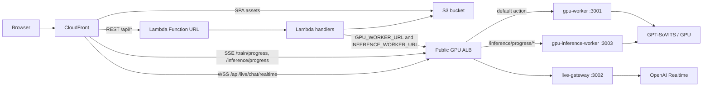

# Lambda Serverless Backend + GPU Worker Guide

Last updated: 2026-05-15

This guide explains the new deployment shape:

- React SPA: S3 + CloudFront
- REST backend: AWS Lambda Function URL behind CloudFront
- GPU work: existing GPU EC2, now split between `gpu-worker` for training on port `3001` and `gpu-inference-worker` for inference on port `3003`
- Live chatbot WebSocket: `live-gateway` process on the same GPU EC2, running on port `3002`
- Current test networking target: one public GPU ALB; ALB default action goes to `gpu-worker:3001`, `/models*`, `/ref-audio*`, and `/inference*` path-route to `gpu-inference-worker:3003`, and `/api/live/chat/realtime` path-routes to `live-gateway:3002`
- Storage handoff: S3 bucket in Singapore (`ap-southeast-1`), even when Lambda and GPU compute run in Seoul (`ap-northeast-2`)
- Function URL auth target: `AWS_IAM` behind CloudFront Lambda Function URL OAC. JSON `POST`/`PUT`/`PATCH`/`DELETE` requests must include `x-amz-content-sha256`; the frontend now adds this automatically through the shared Axios client.

Current known AWS resources:

- GPU EC2: g6 instance in Seoul, running GPT-SoVITS, `gpu-worker`, `gpu-inference-worker`, and `live-gateway`.
- GPU VPC: `VoiClo-Gpu-Seoul-vpc` (`vpc-0b81d044238fcee4d`) in `ap-northeast-2`.
- Public subnets in the GPU VPC:
  - `VoiClo-Gpu-Seoul-subnet-public1-ap-northeast-2a`
  - `VoiClo-Gpu-Seoul-subnet-public2-ap-northeast-2b`
- Internet gateway: `VoiClo-Gpu-Seoul-igw`.
- Public route table: `VoiClo-Gpu-Seoul-rtb-public` (`rtb-0d344d2f505e5d660`).
- GPU ALB: `voice-gpu-alb`, internet-facing, IPv4, HTTP listener on port `80`.
- GPU ALB DNS: `voice-gpu-alb-815777974.ap-northeast-2.elb.amazonaws.com`.
- GPU security group: `VoiClo-Gpu-Seoul-SG` (`sg-0806b2491f69f242e`).
- Training target group: `voice-gpu-worker`, instance target, HTTP port `3001`.
- Inference target group: `voice-gpu-inference-worker`, instance target, HTTP port `3003`.
- Live gateway target group: `voice-live-gateway`, instance target, HTTP port `3002`.
- ALB listener rules: `/api/live/chat/realtime` forwards to `voice-live-gateway`, `/models*`, `/ref-audio*`, and `/inference*` forward to `voice-gpu-inference-worker`, and the default action forwards everything else to `voice-gpu-worker`.
- Frontend S3 bucket: `interns2026-small-projects-bucket-shared`, under prefix `echolect/dist/`.
- CloudFront distribution ID: `E2KTGN0G56FW71`.
- Lambda function: `Liu_Teng_Yu_Intern2026-Voice_Cloning_Project` in `ap-northeast-2`.
- Lambda Function URL host: `fxeoewfr5wdic5dfxtrlsylonq0bvkdy.lambda-url.ap-northeast-2.on.aws`.
- Lambda Function URL auth: use `AWS_IAM` when the origin is protected by CloudFront Lambda Function URL OAC. For emergency debugging only, `NONE` can prove whether a failure is OAC/signature-related.

AWS references worth keeping open:

- Lambda VPC access: https://docs.aws.amazon.com/lambda/latest/dg/configuration-vpc.html
- Lambda VPC internet/S3 access note: https://docs.aws.amazon.com/lambda/latest/dg/configuration-vpc-internet.html
- Lambda Function URLs: https://docs.aws.amazon.com/lambda/latest/dg/urls-configuration.html
- CloudFront with Lambda Function URL origins: https://docs.aws.amazon.com/AmazonCloudFront/latest/DeveloperGuide/DownloadDistS3AndCustomOrigins.html
- Restrict Lambda Function URL access with CloudFront OAC: https://docs.aws.amazon.com/AmazonCloudFront/latest/DeveloperGuide/private-content-restricting-access-to-lambda.html

## What Changed In The Repo

New top-level packages:

- `lambda/`
  - Node.js Lambda handlers for REST routes.
  - `index.handler` is the single Lambda Function URL entrypoint; it routes `/api/*` to the smaller route modules.
  - Handles config, uploads, model listing/loading, training start/stop/current, inference start/result/current/status/stop, transcription, training-audio browsing, and fast live phrase TTS.
- `live-gateway/`
  - Standalone Express + `ws` process that owns `/api/live/chat/realtime`.
  - Reuses the existing OpenAI Realtime bridge logic from the old backend.

GPU worker changes:

- `gpu-worker/` is now training-focused and remains the default worker target on port `3001`
- `GET /train/current`
- `POST /train`
- `POST /train/stop`
- `POST /transcribe`
- `GET /training-audio/*`
- `GET /activity/status`
- Post-training local artifact cleanup after successful S3 upload
- CORS controlled by `CORS_ORIGIN`

New inference worker package:

- `gpu-inference-worker/`
  - Separate Node.js service on port `3003`
  - Owns `/models*`, `/ref-audio*`, and `/inference*`
  - Handles model loading, GPT-SoVITS inference, inference artifacts, and inference activity

Lambda routing changes:

- training routes still use `GPU_WORKER_URL`
- inference and model routes use `INFERENCE_WORKER_URL`

Frontend changes:

- `VITE_API_BASE_URL`: REST API origin; in deployed CloudFront testing, use the CloudFront domain because `/api/*` is proxied to the Lambda Function URL origin
- `VITE_GPU_WORKER_URL`: browser-facing origin for SSE and WebSocket path routing; with CloudFront behaviors, use the CloudFront domain, not the raw HTTP ALB URL
- `VITE_LIVE_GATEWAY_URL`: normally omitted; only set this if live-gateway uses a different public origin
- `client/src/services/api.js`: automatically hashes JSON request bodies for mutating methods and sends `x-amz-content-sha256`, which CloudFront OAC needs when signing `POST` requests to a Lambda Function URL using `AWS_IAM`.

## Traffic Flow



## GPU EC2 Setup

Run the training worker from the GitHub clone under the `ubuntu` user. In the current split setup, this is the ALB default target on port `3001`:

```bash
cd ~/VoiceCloning/gpu-worker
npm install
GPT_SOVITS_ROOT=/opt/gpt-sovits \
PYTHON_EXEC=/opt/gpt-sovits/venv/bin/python \
WORKER_HOST=0.0.0.0 \
WORKER_PORT=3001 \
INFERENCE_HOST=127.0.0.1 \
INFERENCE_PORT=9880 \
S3_BUCKET=interns2026-small-projects-bucket-shared \
S3_REGION=ap-southeast-1 \
S3_PREFIX=echolect/ \
CORS_ORIGIN=https://TRAINING_CLOUDFRONT_DOMAIN,https://LIVE_FAST_CLOUDFRONT_DOMAIN \
npm start
```

The deployment env file for `gpu-worker.service` should contain:

```env
WORKER_HOST=0.0.0.0
WORKER_PORT=3001
GPT_SOVITS_ROOT=/opt/gpt-sovits
PYTHON_EXEC=/opt/gpt-sovits/venv/bin/python
INFERENCE_HOST=127.0.0.1
INFERENCE_PORT=9880
S3_BUCKET=interns2026-small-projects-bucket-shared
S3_REGION=ap-southeast-1
S3_PREFIX=echolect/
CORS_ORIGIN=https://TRAINING_CLOUDFRONT_DOMAIN,https://LIVE_FAST_CLOUDFRONT_DOMAIN
```

Run the inference worker as a second process on the same GPU EC2. If training and inference share one EC2 host, keep training on `3001` and inference on `3003`:

```bash
cd ~/VoiceCloning/gpu-inference-worker
npm install
NODE_ENV=production \
GPT_SOVITS_ROOT=/opt/gpt-sovits \
PYTHON_EXEC=/opt/gpt-sovits/venv/bin/python \
WORKER_HOST=0.0.0.0 \
WORKER_PORT=3003 \
INFERENCE_HOST=127.0.0.1 \
INFERENCE_PORT=9880 \
S3_BUCKET=interns2026-small-projects-bucket-shared \
S3_REGION=ap-southeast-1 \
S3_PREFIX=echolect/ \
CORS_ORIGIN=https://TRAINING_CLOUDFRONT_DOMAIN,https://LIVE_FAST_CLOUDFRONT_DOMAIN \
npm start
```

The deployment env file for `gpu-inference-worker.service` should contain:

```env
NODE_ENV=production
WORKER_HOST=0.0.0.0
WORKER_PORT=3003
GPT_SOVITS_ROOT=/opt/gpt-sovits
PYTHON_EXEC=/opt/gpt-sovits/venv/bin/python
INFERENCE_HOST=127.0.0.1
INFERENCE_PORT=9880
S3_BUCKET=interns2026-small-projects-bucket-shared
S3_REGION=ap-southeast-1
S3_PREFIX=echolect/
CORS_ORIGIN=https://TRAINING_CLOUDFRONT_DOMAIN,https://LIVE_FAST_CLOUDFRONT_DOMAIN
```

GPT-SoVITS itself runs separately on the same EC2:

```bash
cd /opt/gpt-sovits
. venv/bin/activate
python api_v2.py
```

Run the live gateway as a second process on the same GPU EC2. This process owns OpenAI Realtime and the browser WebSocket; `gpu-worker` itself does not talk to OpenAI Realtime:

```bash
cd ~/VoiceCloning/live-gateway
npm install
NODE_ENV=production \
PORT=3002 \
CORS_ORIGIN=https://TRAINING_CLOUDFRONT_DOMAIN,https://LIVE_FAST_CLOUDFRONT_DOMAIN \
OPENAI_API_KEY=sk-... \
OPENAI_REALTIME_MODEL=gpt-realtime \
OPENAI_REALTIME_VAD=semantic_vad \
OPENAI_REALTIME_SYSTEM_PROMPT="You are a casual, helpful assistant. Keep replies concise and conversational." \
npm start
```

The deployment env file for `live-gateway.service` should contain:

```env
NODE_ENV=production
PORT=3002
CORS_ORIGIN=https://TRAINING_CLOUDFRONT_DOMAIN,https://LIVE_FAST_CLOUDFRONT_DOMAIN
OPENAI_API_KEY=
OPENAI_REALTIME_MODEL=gpt-realtime
OPENAI_REALTIME_VAD=semantic_vad
OPENAI_REALTIME_SYSTEM_PROMPT="You are a casual, helpful assistant. Keep replies concise and conversational."
```

Recommended `systemd` setup:

```ini
# /etc/systemd/system/gpu-worker.service
[Unit]
Description=Voice Cloning GPU Worker
After=network.target

[Service]
Type=simple
WorkingDirectory=/home/ubuntu/VoiceCloning/gpu-worker
EnvironmentFile=/home/ubuntu/VoiceCloning/gpu-worker/.env
ExecStart=/usr/bin/npm start
Restart=always
RestartSec=5
User=ubuntu

[Install]
WantedBy=multi-user.target
```

```ini
# /etc/systemd/system/gpu-inference-worker.service
[Unit]
Description=Voice Cloning GPU Inference Worker
After=network.target

[Service]
Type=simple
WorkingDirectory=/home/ubuntu/VoiceCloning/gpu-inference-worker
EnvironmentFile=/home/ubuntu/VoiceCloning/gpu-inference-worker/.env
ExecStart=/usr/bin/npm start
Restart=always
RestartSec=5
User=ubuntu

[Install]
WantedBy=multi-user.target
```

```ini
# /etc/systemd/system/live-gateway.service
[Unit]
Description=Voice Cloning Live Gateway
After=network.target

[Service]
Type=simple
WorkingDirectory=/home/ubuntu/VoiceCloning/live-gateway
EnvironmentFile=/home/ubuntu/VoiceCloning/live-gateway/.env
ExecStart=/usr/bin/npm start
Restart=always
RestartSec=5
User=ubuntu

[Install]
WantedBy=multi-user.target
```

```bash
sudo systemctl daemon-reload
sudo systemctl enable --now gpu-worker
sudo systemctl enable --now gpu-inference-worker
sudo systemctl enable --now live-gateway
sudo systemctl status gpu-worker
sudo systemctl status gpu-inference-worker
sudo systemctl status live-gateway
```

### GPU Worker Local Cleanup And Cache Refresh

S3 is the source of truth for uploaded training audio and trained models. The GPU EC2 still uses local disk while training and inference are running, so local cleanup is split into two layers.

The GPU worker now performs post-training cleanup after a successful run:

1. Training writes scratch data, extracted features, logs, and checkpoints locally.
2. The GPU worker uploads final outputs to S3.
3. Only after the S3 upload succeeds, the GPU worker deletes:

```text
/opt/gpt-sovits/worker_temp/<EXP_NAME>
/opt/gpt-sovits/logs/<EXP_NAME>
```

The GPU worker does not delete the inference model cache or local model weight folders during the training completion path. Those are cleaned by a daily EC2 cron job so the next model load refreshes from S3:

```text
/opt/gpt-sovits/worker_temp/model_cache
/opt/gpt-sovits/GPT_weights_v2
/opt/gpt-sovits/SoVITS_weights_v2
```

Install the daily local cache refresh job on the GPU EC2:

```bash
sudo tee /etc/cron.daily/gpt-sovits-local-cleanup >/dev/null <<'EOF'
#!/bin/sh
set -eu

if pgrep -f 's1_train.py|s2_train.py' >/dev/null 2>&1; then
  echo "Training is running; skipping GPT-SoVITS cleanup."
  exit 0
fi

echo "Cleaning GPT-SoVITS local model caches..."

rm -rf /opt/gpt-sovits/worker_temp/model_cache/*
rm -rf /opt/gpt-sovits/GPT_weights_v2/*
rm -rf /opt/gpt-sovits/SoVITS_weights_v2/*

df -h /
EOF

sudo chmod +x /etc/cron.daily/gpt-sovits-local-cleanup
```

Verify that the daily refresh job is registered:

```bash
sudo run-parts --test /etc/cron.daily | grep gpt-sovits-local-cleanup
```

Verify that the daily refresh job deletes local cache files:

```bash
sudo mkdir -p /opt/gpt-sovits/worker_temp/model_cache
sudo mkdir -p /opt/gpt-sovits/GPT_weights_v2
sudo mkdir -p /opt/gpt-sovits/SoVITS_weights_v2

sudo touch /opt/gpt-sovits/worker_temp/model_cache/test-cache.ckpt
sudo touch /opt/gpt-sovits/GPT_weights_v2/test-gpt.ckpt
sudo touch /opt/gpt-sovits/SoVITS_weights_v2/test-sovits.pth

sudo ls -lah /opt/gpt-sovits/worker_temp/model_cache
sudo ls -lah /opt/gpt-sovits/GPT_weights_v2
sudo ls -lah /opt/gpt-sovits/SoVITS_weights_v2

sudo /etc/cron.daily/gpt-sovits-local-cleanup

sudo ls -lah /opt/gpt-sovits/worker_temp/model_cache
sudo ls -lah /opt/gpt-sovits/GPT_weights_v2
sudo ls -lah /opt/gpt-sovits/SoVITS_weights_v2
df -h /
```

Expected result: the test files are gone, the directories still exist, and root disk free space does not decrease.

Verify that post-training cleanup happens after S3 upload:

```bash
EXP_NAME="YourExperimentName"

# During training, these directories should exist and may grow.
sudo du -sh /opt/gpt-sovits/worker_temp/$EXP_NAME /opt/gpt-sovits/logs/$EXP_NAME 2>/dev/null

# After the UI reports successful training completion, local experiment data should be gone.
test ! -d /opt/gpt-sovits/worker_temp/$EXP_NAME && echo "worker_temp cleaned" || echo "worker_temp still exists"
test ! -d /opt/gpt-sovits/logs/$EXP_NAME && echo "logs cleaned" || echo "logs still exists"

# The final trained models should remain available in S3.
aws s3 ls s3://interns2026-small-projects-bucket-shared/echolect/models/user-models/gpt/ | tail
aws s3 ls s3://interns2026-small-projects-bucket-shared/echolect/models/user-models/sovits/ | tail
```

If the local experiment directories still exist after a completed training run, confirm that the GPU EC2 has pulled the latest `gpu-worker` code and restarted `gpu-worker.service`.

## ALB Routing

Current test setup uses one public ALB in front of the GPU EC2.

The ALB is in the same Seoul VPC as the GPU EC2. The AWS console shows the ALB mapped across two availability zones, so it should be attached to both public subnets:

- `VoiClo-Gpu-Seoul-subnet-public1-ap-northeast-2a`
- `VoiClo-Gpu-Seoul-subnet-public2-ap-northeast-2b`

The GPU EC2 itself is in `VoiClo-Gpu-Seoul-subnet-public1-ap-northeast-2a`.

Two ALB subnets is expected. Application Load Balancers are designed to span at least two availability zones for availability. The ALB can still route to a single GPU EC2 target in one subnet; the second subnet is for ALB nodes, not a requirement that the app has two GPU instances.

### ALB Target Groups

Create or confirm these target groups:

| Target group | Target | Port | Health check |
| --- | --- | ---: | --- |
| `voice-gpu-worker` | GPU EC2 instance | `3001` | `GET /healthz` |
| `voice-gpu-inference-worker` | same GPU EC2 instance | `3003` | `GET /healthz` |
| `voice-live-gateway` | same GPU EC2 instance | `3002` | `GET /healthz` |

Current screenshot state:

- `voice-gpu-worker` already exists and points to port `3001`.
- Its target is currently `Unused: Target is in the stopped state` because the EC2 instance was stopped when the screenshot was taken. This should become healthy after the GPU EC2 and `gpu-worker.service` are running.
- `voice-gpu-inference-worker` should be created and registered on port `3003` if training and inference share one EC2 host.
- `voice-live-gateway` still needs to be created and registered on port `3002`.

### ALB Listener Rules

Use one HTTP listener on port `80` while testing. Later, add HTTPS on port `443` if you attach a certificate directly to the ALB.

| Priority | Condition | Action |
| ---: | --- | --- |
| `1` | Path is `/api/live/chat/realtime` | Forward to `voice-live-gateway` |
| `2` | Path is `/models*` | Forward to `voice-gpu-inference-worker` |
| `3` | Path is `/ref-audio*` | Forward to `voice-gpu-inference-worker` |
| `4` | Path is `/inference*` | Forward to `voice-gpu-inference-worker` |
| default | Everything else | Forward to `voice-gpu-worker` |

Keep `/train/progress/*`, `/healthz`, and `/training-audio/*` on the default training target group. Route `/models*`, `/ref-audio*`, and all `/inference*` paths to the inference target group so both browser SSE and Lambda inference/model calls reach `gpu-inference-worker`.

Lambda can call the public ALB URL directly:

```text
GpuWorkerUrl=http://voice-gpu-alb-815777974.ap-northeast-2.elb.amazonaws.com
```

The browser should use the HTTPS CloudFront domain when CloudFront is routing SSE/WSS to that ALB origin:

```env
VITE_GPU_WORKER_URL=https://d3dghqhnk7aoku.cloudfront.net
# Optional only if live gateway has a separate origin:
# VITE_LIVE_GATEWAY_URL=https://YOUR_LIVE_GATEWAY_DOMAIN
```

The browser derives the live WebSocket URL from `VITE_GPU_WORKER_URL`, so it connects to:

```text
wss://d3dghqhnk7aoku.cloudfront.net/api/live/chat/realtime
```

CloudFront can also use the same GPU ALB origin for SSE and WSS. Configure behaviors in this order:

- `/api/live/chat/realtime` -> GPU ALB origin, caching disabled, WebSocket upgrade headers forwarded
- `/train/progress/*` -> GPU ALB origin, caching disabled
- `/inference/progress/*` -> GPU ALB origin, caching disabled
- `/api/*` -> Lambda Function URL origin
- default `/*` -> S3 SPA origin

The `/api/live/chat/realtime` behavior must have higher priority than `/api/*`; otherwise CloudFront may send the WebSocket request to the Lambda Function URL or the SPA fallback.

The live-gateway target group can still health check `GET /healthz` on port `3002`; this does not require exposing `/healthz` through a public ALB listener rule.

Current security group note: `sg-0806b2491f69f242e` is used for the GPU EC2 and ALB right now. This works for testing, but split it later into a dedicated ALB security group and a dedicated GPU EC2 security group:

- ALB SG inbound: HTTP `80` from CloudFront/browser while testing; later HTTPS `443`.
- ALB SG outbound: TCP `3001`, `3002`, and `3003` to the GPU EC2 SG.
- GPU EC2 SG inbound: TCP `3001`, `3002`, and `3003` only from the ALB SG.
- GPU EC2 SG inbound: SSH `22` from your own IP only, if SSH is still needed.
- GPU EC2 SG inbound: no rule for `9880`; GPT-SoVITS `api_v2.py` should stay local on `127.0.0.1:9880`.
- Do not leave direct public inbound access to `3001`, `3002`, or `9880` in production.

There is no separate inbound rule for SSE. Training and inference SSE are normal HTTP traffic from the browser to CloudFront, then CloudFront to the ALB on `80` or `443`, then the ALB forwards `/train/progress/*` to the default training target group and `/inference/progress/*` to the inference target group.

## CloudFront Origins And Behaviors

CloudFront has three kinds of origins in this setup: the SPA bucket, Lambda Function URL, and the GPU ALB. The current frontend bucket uses an S3 REST origin protected by OAI.

### Origins

| Origin name | Origin domain | Protocol to origin | Origin path |
| --- | --- | --- | --- |
| `spa-s3-origin` | frontend S3 REST origin | existing S3/OAI setting | blank |
| `lambda-function-url-origin` | `fxeoewfr5wdic5dfxtrlsylonq0bvkdy.lambda-url.ap-northeast-2.on.aws` | HTTPS only, port `443` | blank |
| `gpu-worker-alb-origin` | `voice-gpu-alb-815777974.ap-northeast-2.elb.amazonaws.com` | HTTP only, port `80` | blank |

For the S3 origin, keep the existing OAI permission model. For the Lambda Function URL origin, do not include `https://` or `/api` in the origin domain. For the GPU ALB origin, do not include `http://` or any path.

Current Lambda Function URL access status:

- Recommended setting: Function URL `AuthType` is `AWS_IAM`.
- CloudFront requirement: attach a Lambda Function URL OAC, set signing behavior to sign requests, and leave `Do not override authorization header` unchecked.
- POST requirement: JSON `POST`/`PUT`/`PATCH`/`DELETE` requests need `x-amz-content-sha256`. The frontend shared Axios client now computes this from the exact JSON body string before sending.
- Lambda CORS requirement: `Access-Control-Allow-Headers` must include `x-amz-content-sha256`; `lambda/shared/cors.js` includes it.
- Existing resource-based policy already allows `cloudfront.amazonaws.com` to call `lambda:InvokeFunctionUrl` and `lambda:InvokeFunction` from `arn:aws:cloudfront::329599637774:distribution/E2KTGN0G56FW71`.
- Debug fallback only: temporarily switching Function URL `AuthType` to `NONE` can separate app bugs from IAM/OAC signing bugs, but do not keep this as the secure production mode.

### Behaviors

Order matters. Put the most specific behaviors above broader ones:

| Priority | Path pattern | Origin | Cache policy | Origin request policy | Notes |
| ---: | --- | --- | --- | --- | --- |
| `1` | `/api/live/chat/realtime` | `gpu-worker-alb-origin` | Caching disabled | Forward WebSocket headers or use `AllViewer` | Must be above `/api/*`; routes to `live-gateway:3002` at ALB |
| `2` | `/train/progress/*` | `gpu-worker-alb-origin` | Caching disabled | Forward `Origin` at minimum | SSE to `gpu-worker:3001` |
| `3` | `/inference/progress/*` | `gpu-worker-alb-origin` | Caching disabled | Forward `Origin` at minimum | SSE to `gpu-inference-worker:3003` |
| `4` | `/api/*` | `lambda-function-url-origin` | Caching disabled | `AllViewerExceptHostHeader` | REST Lambda Function URL proxied through CloudFront; must forward `x-amz-content-sha256` for signed POST requests |
| default | `*` | `spa-s3-origin` | normal SPA/static policy | existing setting | React app |

For `/api/live/chat/realtime`, CloudFront must forward WebSocket upgrade headers. If you use a managed policy, start with `AllViewer`. If you create a custom origin request policy, include at least:

- `Host` only if your origin requires it; Lambda Function URL should not receive the CloudFront viewer `Host` when using the default `lambda-url` domain
- `Origin`
- `Connection`
- `Upgrade`
- `Sec-WebSocket-Key`
- `Sec-WebSocket-Version`
- `Sec-WebSocket-Protocol`
- `Sec-WebSocket-Extensions`

For `/api/*` to Lambda Function URL, prefer `AllViewerExceptHostHeader`. Forwarding the CloudFront viewer `Host` header to the default `lambda-url` domain can cause origin routing issues. If you create a custom origin request policy instead of the managed one, forward `Origin`, `Content-Type`, and `x-amz-content-sha256` at minimum for browser JSON POST requests.

### Error Pages

During backend/debugging work, use only this SPA fallback:

| HTTP error code | Response page path | HTTP response code |
| ---: | --- | ---: |
| `404` | `/index.html` | `200` |

Do not add `403 -> /index.html -> 200`. A global 403 rewrite hides real Lambda Function URL, OAC, S3, and permissions errors by returning the React app HTML. Keep 403 visible so backend/security problems are debuggable.

For user-facing demos after backend checks are done, a temporary `403 -> /index.html -> 200` fallback can make direct refreshes on React routes such as `/live-fast` work with the S3 REST origin. Remove or disable it again when debugging CloudFront/Lambda/S3 access problems.

## Lambda Deployment

### AWS CLI Profiles

For deployment, configure the base AWS profile, then the role-assuming profile:

```powershell
aws configure --profile account11
aws sts get-caller-identity --profile account11
notepad $env:USERPROFILE\.aws\config
```

Example profile block:

```ini
[profile account3]
role_arn = arn:aws:iam::3XXXXXXXXXXX:role/YOUR_ROLE_NAME
source_profile = account11
region = ap-southeast-1
output = json
```

Verify the deploy profile:

```powershell
aws sts get-caller-identity --profile account3
```

Use `--profile account3` on AWS CLI commands if that shell is not already using the intended AWS credentials.

Install dependencies, test, and package a plain Lambda zip:

```powershell
cd lambda
npm install
npm test
npm run package:function-url
```

The package is written to:

```text
lambda/.dist/voice-cloning-function-url.zip
```

Deploy for the current public-GPU-ALB test setup. This does not attach Lambda to a VPC because Lambda can call the public ALB URL directly.

Current deployed Lambda region is `ap-northeast-2` (Seoul). The S3 bucket remains in `ap-southeast-1` (Singapore), so keep `S3_REGION=ap-southeast-1` even though the Lambda function itself is in Seoul. Setting `S3_REGION` to the Lambda region causes S3 endpoint errors such as `The bucket you are attempting to access must be addressed using the specified endpoint`.

Create the Lambda function manually in the AWS console or with AWS CLI. Use:

- Runtime: Node.js 20.x
- Handler: `index.handler`
- Architecture: `x86_64`
- Timeout: `120` seconds for normal REST calls; increase if your supervisor wants longer synchronous calls
- Memory: `256` MB or higher
- Function URL: enabled
- Function URL auth: `AWS_IAM` for the locked-down CloudFront OAC setup. Use `NONE` only as a short debugging fallback when isolating OAC/signature issues.

Environment variables:

```text
S3_BUCKET=interns2026-small-projects-bucket-shared
S3_REGION=ap-southeast-1
S3_PREFIX=echolect/
GPU_WORKER_URL=http://voice-gpu-alb-815777974.ap-northeast-2.elb.amazonaws.com
GPU_WORKER_PUBLIC_URL=https://d3dghqhnk7aoku.cloudfront.net
INFERENCE_WORKER_URL=http://voice-gpu-alb-815777974.ap-northeast-2.elb.amazonaws.com
INFERENCE_WORKER_PUBLIC_URL=https://d3dghqhnk7aoku.cloudfront.net
GPU_INSTANCE_ID=i-REPLACE_WITH_GPU_EC2_INSTANCE_ID
GPU_INSTANCE_REGION=ap-northeast-2
GPU_IDLE_STOP_MINUTES=30
MODEL_SOURCE=s3
ARTIFACT_SOURCE=s3
CORS_ORIGIN=https://TRAINING_CLOUDFRONT_DOMAIN,https://LIVE_FAST_CLOUDFRONT_DOMAIN
```

In the public-ALB split setup, `GPU_WORKER_URL` and `INFERENCE_WORKER_URL` can both use the same ALB base URL only if the ALB has path rules for `/models*`, `/ref-audio*`, and `/inference*` that forward to the inference target group. If you do not want to add those ALB rules, point `INFERENCE_WORKER_URL` directly at the inference worker host and port instead.

The old `GPU_INSTANCE_MOCK_STATE` local UI path has been removed. Configure a real `GPU_INSTANCE_ID` and test GPU start/status against the cloud services.

The Lambda CORS helper must allow `x-amz-content-sha256`. This repo does that in `lambda/shared/cors.js`. Without this allowed header, browser preflight can block signed JSON `POST` requests before they reach CloudFront/Lambda.

The Lambda execution role also needs permission to read and start the GPU EC2 instance:

```json
{
  "Version": "2012-10-17",
  "Statement": [
    {
      "Effect": "Allow",
      "Action": [
        "ec2:DescribeInstances",
        "ec2:StartInstances",
        "ec2:StopInstances"
      ],
      "Resource": "*"
    }
  ]
}
```

`GPU_IDLE_STOP_MINUTES` controls automatic shutdown. `0` disables it. A good starting value is `30`, then adjust up or down based on your demo/workload pattern.

Create once with CLI, replacing the role ARN. For the current Seoul Lambda, use `ap-northeast-2` and the deployed function name:

```powershell
aws lambda create-function `
  --profile account3 `
  --region ap-northeast-2 `
  --function-name Liu_Teng_Yu_Intern2026-Voice_Cloning_Project `
  --runtime nodejs20.x `
  --handler index.handler `
  --architectures x86_64 `
  --timeout 120 `
  --memory-size 256 `
  --role arn:aws:iam::YOUR_ACCOUNT_ID:role/YOUR_LAMBDA_EXECUTION_ROLE `
  --zip-file fileb://.dist/voice-cloning-function-url.zip `
  --environment "Variables={S3_BUCKET=interns2026-small-projects-bucket-shared,S3_REGION=ap-southeast-1,S3_PREFIX=echolect/,GPU_WORKER_URL=http://voice-gpu-alb-815777974.ap-northeast-2.elb.amazonaws.com,GPU_WORKER_PUBLIC_URL=https://LIVE_FAST_CLOUDFRONT_DOMAIN,INFERENCE_WORKER_URL=http://voice-gpu-alb-815777974.ap-northeast-2.elb.amazonaws.com,INFERENCE_WORKER_PUBLIC_URL=https://LIVE_FAST_CLOUDFRONT_DOMAIN,GPU_INSTANCE_ID=i-REPLACE_WITH_GPU_EC2_INSTANCE_ID,GPU_INSTANCE_REGION=ap-northeast-2,GPU_IDLE_STOP_MINUTES=30,MODEL_SOURCE=s3,ARTIFACT_SOURCE=s3,CORS_ORIGIN=https://TRAINING_CLOUDFRONT_DOMAIN,https://LIVE_FAST_CLOUDFRONT_DOMAIN}"
```

Update code after later changes:

```powershell
aws lambda update-function-code `
  --profile account3 `
  --region ap-northeast-2 `
  --function-name Liu_Teng_Yu_Intern2026-Voice_Cloning_Project `
  --zip-file fileb://.dist/voice-cloning-function-url.zip
```

Update environment after adding GPU instance control:

```powershell
aws lambda update-function-configuration `
  --profile account3 `
  --region ap-northeast-2 `
  --function-name Liu_Teng_Yu_Intern2026-Voice_Cloning_Project `
  --environment "Variables={S3_BUCKET=interns2026-small-projects-bucket-shared,S3_REGION=ap-southeast-1,S3_PREFIX=echolect/,GPU_WORKER_URL=http://voice-gpu-alb-815777974.ap-northeast-2.elb.amazonaws.com,GPU_WORKER_PUBLIC_URL=https://LIVE_FAST_CLOUDFRONT_DOMAIN,INFERENCE_WORKER_URL=http://voice-gpu-alb-815777974.ap-northeast-2.elb.amazonaws.com,INFERENCE_WORKER_PUBLIC_URL=https://LIVE_FAST_CLOUDFRONT_DOMAIN,GPU_INSTANCE_ID=i-REPLACE_WITH_GPU_EC2_INSTANCE_ID,GPU_INSTANCE_REGION=ap-northeast-2,GPU_IDLE_STOP_MINUTES=30,MODEL_SOURCE=s3,ARTIFACT_SOURCE=s3,CORS_ORIGIN=https://TRAINING_CLOUDFRONT_DOMAIN,https://LIVE_FAST_CLOUDFRONT_DOMAIN}"
```

Required for automatic GPU shutdown: add an EventBridge schedule so Lambda checks idleness without a user opening the app. `GPU_IDLE_STOP_MINUTES` only sets the idle threshold inside Lambda. It does not run a timer by itself.

The rule below calls the Lambda every five minutes. The actual shutdown happens only when `/activity/status` says the worker is not training or generating and has been idle longer than `GPU_IDLE_STOP_MINUTES`. With `GPU_IDLE_STOP_MINUTES=30`, stop time is roughly 30 to 35 minutes after last activity. With `GPU_IDLE_STOP_MINUTES=1` for testing, stop time is roughly 1 to 6 minutes.

The GPU worker activity timer is refreshed only by real worker-side progress or active work, such as a running training subprocess, an active streaming inference session, direct synthesis, model load/start/stop operations, training logs, or training/inference state transitions. Passive frontend traffic does not refresh the timer: frontend restore calls like `/train/current` and `/inference/current`, inference status polling, model list reads, and SSE progress connections are ignored. ALB `GET /healthz` is also ignored. EventBridge/Lambda `GET /activity/status` is passive while the worker is idle. It refreshes the timer only when the worker can prove active work is present, such as a running training subprocess or active inference session; a stale `waiting`/`running`/`generating` status by itself does not keep the EC2 instance alive. If Lambda sees a busy worker whose `idleMs` is already past `GPU_IDLE_STOP_MINUTES`, it treats that as stale busy state and stops the instance.

```powershell
$profile = "account3"
$region = "ap-northeast-2"
$functionName = "Liu_Teng_Yu_Intern2026-Voice_Cloning_Project"
$ruleName = "voice-cloning-gpu-idle-stop"

$accountId = aws sts get-caller-identity `
  --profile $profile `
  --query Account `
  --output text

$functionArn = aws lambda get-function `
  --profile $profile `
  --region $region `
  --function-name $functionName `
  --query "Configuration.FunctionArn" `
  --output text

aws events put-rule `
  --profile $profile `
  --region $region `
  --name $ruleName `
  --schedule-expression "rate(5 minutes)" `
  --state ENABLED

aws lambda add-permission `
  --profile $profile `
  --region $region `
  --function-name $functionName `
  --statement-id AllowEventBridgeGpuIdleStop `
  --action lambda:InvokeFunction `
  --principal events.amazonaws.com `
  --source-arn "arn:aws:events:$region:$accountId:rule/$ruleName"

$targetInput = '{"rawPath":"/api/instance/idle-check","requestContext":{"http":{"method":"POST"}}}'
$targets = @(
  @{
    Id = "1"
    Arn = $functionArn
    Input = $targetInput
  }
) | ConvertTo-Json -Compress

Set-Content -Path ".\eventbridge-targets.json" -Value $targets

aws events put-targets `
  --profile $profile `
  --region $region `
  --rule $ruleName `
  --targets file://eventbridge-targets.json
```

If `add-permission` reports that `AllowEventBridgeGpuIdleStop` already exists, continue with `put-targets`.

Verify the schedule:

```powershell
aws events describe-rule `
  --profile account3 `
  --region ap-northeast-2 `
  --name voice-cloning-gpu-idle-stop

aws events list-targets-by-rule `
  --profile account3 `
  --region ap-northeast-2 `
  --rule voice-cloning-gpu-idle-stop
```

Manual idle-check test:

```powershell
curl -X POST https://d3dghqhnk7aoku.cloudfront.net/api/instance/idle-check
curl https://d3dghqhnk7aoku.cloudfront.net/api/instance/status
```

Expected after the worker has been idle longer than the threshold:

```json
{
  "checked": true,
  "stopped": true,
  "reason": "idle-timeout",
  "state": "stopping"
}
```

Create the Function URL with IAM auth:

```powershell
aws lambda create-function-url-config `
  --profile account3 `
  --region ap-northeast-2 `
  --function-name Liu_Teng_Yu_Intern2026-Voice_Cloning_Project `
  --auth-type AWS_IAM
```

If you temporarily switch to `NONE` while debugging, switch back to `AWS_IAM` after the CloudFront Lambda Function URL OAC path is confirmed healthy.

Add the Function URL as a CloudFront origin:

1. Copy the Function URL domain only, currently `fxeoewfr5wdic5dfxtrlsylonq0bvkdy.lambda-url.ap-northeast-2.on.aws`.
2. Create a CloudFront origin using that domain, HTTPS only, origin path blank.
3. Attach a Lambda Function URL OAC and enable request signing. Use origin type `Lambda`, signing behavior `Sign requests`, and leave `Do not override authorization header` unchecked.
4. Point the `/api/*` behavior to this origin.
5. Keep `/api/live/chat/realtime` above `/api/*`, because Live WebSocket goes to the GPU ALB, not Lambda.

Allow CloudFront to invoke the Function URL when using `AWS_IAM`. These permissions already exist for the current distribution:

```powershell
$distributionArn = "arn:aws:cloudfront::329599637774:distribution/E2KTGN0G56FW71"

aws lambda add-permission `
  --profile account3 `
  --region ap-northeast-2 `
  --function-name Liu_Teng_Yu_Intern2026-Voice_Cloning_Project `
  --statement-id AllowCloudFrontFunctionUrl `
  --action lambda:InvokeFunctionUrl `
  --principal cloudfront.amazonaws.com `
  --function-url-auth-type AWS_IAM `
  --source-arn $distributionArn

aws lambda add-permission `
  --profile account3 `
  --region ap-northeast-2 `
  --function-name Liu_Teng_Yu_Intern2026-Voice_Cloning_Project `
  --statement-id AllowCloudFrontInvokeFunction `
  --action lambda:InvokeFunction `
  --principal cloudfront.amazonaws.com `
  --source-arn $distributionArn
```

Notes:

- `GpuWorkerUrl` is what Lambda calls. For now, use the public ALB URL.
- `GpuWorkerPublicUrl` is what the browser can use for direct artifact URLs if `ArtifactSource=gpu-worker`. With CloudFront behaviors, prefer the CloudFront URL here; with `ArtifactSource=s3`, it is not used for result playback.
- `ArtifactSource=s3` means generated final WAVs and training audio URLs are served through S3 presigned URLs in deployed Lambda.
- `ModelSource=s3` means `/api/models` reads GPT and SoVITS checkpoint names from S3, then downloads the selected pair to the GPU worker cache before loading them. `ModelSource=gpu-worker` is only for debugging the weights currently present on the GPU server's local disk.

## S3 Bucket Layout

The project uses bucket `interns2026-small-projects-bucket-shared` with prefix `echolect/`:

| S3 path | Purpose |
| --- | --- |
| `echolect/audio/` | General audio storage |
| `echolect/audio/reference/` | Reference voice samples |
| `echolect/audio/output/` | Generated output audio |
| `echolect/models/` | Model storage |
| `echolect/models/user-models/` | User-trained or selected model files |
| `echolect/training/` | Training-related storage |
| `echolect/training/datasets/` | Training datasets |
| `echolect/dist/` | Frontend build files |

The GPU EC2 instance profile already has access to this bucket/prefix, so `gpu-worker` should use instance-role credentials rather than long-lived keys on the server.

## Future Private GPU Worker Plan

When the GPU EC2 is moved off the public internet, there are two valid Lambda-to-GPU options.

Recommended for scalability:

- Public ALB: internet-facing, used only by CloudFront for browser SSE/WSS routes.
- Internal ALB: private, used by Lambda for REST-triggered calls into the GPU worker.
- GPU EC2: private subnet, no app traffic to its public IP.

Acceptable for a single fixed GPU EC2:

- Public ALB: internet-facing, used by CloudFront for browser SSE/WSS routes.
- Lambda in the same VPC calls the GPU EC2 private IP directly on `3001`.
- GPU EC2 SG allows `3001` from Lambda SG.

The direct private-IP option is simpler and secure enough for one fixed EC2 in the same VPC, but it is less scalable. If the GPU EC2 is replaced and its private IP changes, `GPU_WORKER_URL` must be updated. The internal ALB option gives stable DNS, health checks, and easier future scaling.

Scalable future traffic flow:

```text
Browser -> CloudFront -> public ALB -> private GPU EC2
Lambda in Seoul VPC -> internal ALB -> private GPU EC2
GPU EC2 private subnet -> S3 Gateway VPC Endpoint -> S3
```

Change the architecture like this:

1. Put the GPU worker EC2 in private subnets.
2. Move or recreate the Lambda function in Seoul (`ap-northeast-2`) or otherwise ensure it has private network connectivity to the Seoul VPC.
3. Keep an internet-facing public ALB for CloudFront browser SSE/WSS paths.
4. Either add a second internal ALB for Lambda-to-GPU private traffic, or point Lambda directly to the GPU EC2 private IP for the single-instance setup.
5. Change `GpuWorkerUrl` to the private/internal ALB URL, for example `http://internal-voice-gpu-alb-...:80`, or to the EC2 private URL, for example `http://10.0.x.x:3001`.
6. Keep `GpuWorkerPublicUrl` as the public CloudFront URL for browser SSE/WSS paths.
7. Add an S3 Gateway VPC Endpoint so private GPU EC2 can reach S3 without public internet: `EC2 (private) -> VPC Endpoint -> S3`.
8. Update the Lambda function with VPC parameters:

```powershell
aws lambda update-function-configuration `
  --profile account3 `
  --region ap-northeast-2 `
  --function-name voice-cloning-api `
  --vpc-config SubnetIds=subnet-aaa,subnet-bbb,SecurityGroupIds=sg-lambda `
  --environment "Variables={S3_BUCKET=interns2026-small-projects-bucket-shared,S3_REGION=ap-southeast-1,S3_PREFIX=echolect/,GPU_WORKER_URL=http://INTERNAL_GPU_ALB_DNS,GPU_WORKER_PUBLIC_URL=https://LIVE_FAST_CLOUDFRONT_DOMAIN,INFERENCE_WORKER_URL=http://INTERNAL_GPU_ALB_DNS,INFERENCE_WORKER_PUBLIC_URL=https://LIVE_FAST_CLOUDFRONT_DOMAIN,MODEL_SOURCE=s3,ARTIFACT_SOURCE=s3,CORS_ORIGIN=https://TRAINING_CLOUDFRONT_DOMAIN,https://LIVE_FAST_CLOUDFRONT_DOMAIN}"
```

9. Security groups:

- Lambda security group outbound -> internal ALB security group TCP `80`, or GPU EC2 security group TCP `3001` and `3003` for direct private-IP mode.
- Internal ALB security group inbound from Lambda security group TCP `80`, if using internal ALB.
- Public ALB security group inbound HTTPS `443` from CloudFront/browser traffic
- GPU EC2 security group inbound from public ALB security group TCP `3001`, `3002`, and `3003`
- GPU EC2 security group inbound from internal ALB security group TCP `3001` and `3003`, if using internal ALB.
- GPU EC2 security group inbound from Lambda security group TCP `3001` and `3003`, if using direct private-IP mode.

If Lambda is VPC-attached, make sure it can still reach S3. Use either:

- NAT Gateway / NAT instance for outbound internet access
- S3 Gateway VPC Endpoint for private S3 access

For future scalability, prefer routing Lambda through the internal ALB instead of directly to the EC2 private IP. For a single fixed GPU EC2 in the same VPC, direct private IP is acceptable if you are comfortable updating both `GPU_WORKER_URL` and `INFERENCE_WORKER_URL` whenever the instance is replaced.

## Frontend Deployment

Create or update the frontend production env. Because each CloudFront distribution proxies its own `/api/*` and GPU SSE/WSS paths, the split deployment should use same-origin frontend URLs. Build one Training bundle and one Live Fast bundle:

```env
VITE_APP_BASENAME=/
VITE_APP_MODE=training
# or: VITE_APP_MODE=live-fast
# Leave VITE_API_BASE_URL, VITE_GPU_WORKER_URL, and VITE_LIVE_GATEWAY_URL unset
# unless the browser must call a different public origin.
```

Build and upload both frontend apps to separate S3 prefixes:

```bash
cd client
npm install
npm run build:training
npm run build:live-fast
aws s3 sync dist-training/ s3://interns2026-small-projects-bucket-shared/echolect/dist-training/ --delete
aws s3 sync dist-live-fast/ s3://interns2026-small-projects-bucket-shared/echolect/dist-live-fast/ --delete
aws cloudfront create-invalidation --distribution-id TRAINING_DISTRIBUTION_ID --paths "/*"
aws cloudfront create-invalidation --distribution-id LIVE_FAST_DISTRIBUTION_ID --paths "/*"
```

Point the Training CloudFront S3 origin path at `/echolect/dist-training`. Point the Live Fast CloudFront S3 origin path at `/echolect/dist-live-fast`. Both distributions can reuse the same Lambda Function URL origin and GPU ALB origin so Training writes to S3 and Live Fast reads the same S3 model/reference outputs.

Split CloudFront routing map:

| Distribution | Default S3 origin path | Required backend behaviors |
| --- | --- | --- |
| Training CloudFront | `/echolect/dist-training` | `/api/*` -> Lambda Function URL, `/train/progress/*` -> GPU ALB |
| Live Fast CloudFront | `/echolect/dist-live-fast` | `/api/live/chat/realtime` -> GPU ALB, `/api/*` -> Lambda Function URL |

Keep `/api/live/chat/realtime` above `/api/*` on the Live Fast distribution. You can keep `/inference/progress/*` on either distribution for backend compatibility, but it is no longer user-facing. The Training distribution does not need the Live WebSocket behavior unless you want both distributions to be fully interchangeable for debugging.

Frontend-only changes, such as UI text, route gating, mic controls, replay buttons, and local live-chat state handling, need only the build/sync/invalidation commands above.

Changes under `live-gateway/` need a GPU EC2 service restart after pulling the code:

```bash
cd ~/VoiceCloning
git pull
cd live-gateway
npm install
sudo systemctl restart live-gateway
sudo systemctl status live-gateway
```

Changes under `lambda/` need:

```powershell
cd lambda
npm run package:function-url
aws lambda update-function-code `
  --profile account3 `
  --region ap-northeast-2 `
  --function-name Liu_Teng_Yu_Intern2026-Voice_Cloning_Project `
  --zip-file fileb://.dist/voice-cloning-function-url.zip
```

Changes under `gpu-worker/` need a GPU EC2 service restart:

```bash
cd ~/VoiceCloning
git pull
cd gpu-worker
npm install
sudo systemctl restart gpu-worker
sudo systemctl status gpu-worker
```

Changes under `gpu-inference-worker/` need the inference service restart:

```bash
cd ~/VoiceCloning
git pull
cd gpu-inference-worker
npm install
sudo systemctl restart gpu-inference-worker
sudo systemctl status gpu-inference-worker
```

No deployment env should use the GPU EC2 public IP directly. Use:

- CloudFront domain for browser-facing frontend/API/SSE/WSS.
- GPU ALB DNS for Lambda-to-GPU calls while testing publicly.
- Future internal ALB DNS for Lambda-to-GPU calls after the private setup.

The GPU EC2 public IP is only useful for administrative access, such as temporary SSH, unless you replace SSH with SSM Session Manager.

## Cloud-Connected Frontend Testing

Local mock and Lambda-local testing have been removed from the normal workflow. For frontend testing, run the React dev server and let it call the deployed CloudFront/Lambda/GPU services directly.

Use `client/.env` with the CloudFront target:

```env
PROXY_TARGET=https://d3dghqhnk7aoku.cloudfront.net
VITE_GPU_WORKER_URL=
VITE_LIVE_GATEWAY_URL=https://d3dghqhnk7aoku.cloudfront.net
```

Run the frontend:

```bash
cd client
npm install
npm run dev
```

Then open `http://localhost:5173`.

Dev URL map:

- REST API: browser calls `/api/*`; Vite proxies it to `PROXY_TARGET`.
- Training SSE: browser calls `/train/progress/*`; Vite proxies it to `PROXY_TARGET`.
- Live chatbot WebSocket: browser opens `wss://d3dghqhnk7aoku.cloudfront.net/api/live/chat/realtime`.
- Frontend: `http://localhost:5173`.

Keep the GPU EC2, `gpu-worker.service`, `gpu-inference-worker.service`, `live-gateway.service`, Lambda Function URL, CloudFront behaviors, and S3 bucket configured exactly as deployment uses them. This is intentionally closer to the real release path than the old fake local stack.

## Smoke Tests

REST through Lambda:

```bash
API=https://d3dghqhnk7aoku.cloudfront.net
curl "$API/api/config"
curl "$API/api/models"
curl "$API/api/train/current"
curl "$API/api/inference/current"
curl "$API/api/inference/status"
```

Expected:

- `/api/config` returns `{"storageMode":"s3","inferenceMode":"remote"}`
- current-state endpoints return JSON, even when idle
- `/api/models` returns `gpt` and `sovits` arrays from S3 when `ModelSource=s3`

GPU worker direct:

```bash
GPU=https://YOUR_GPU_WORKER_ALB_DOMAIN
curl "$GPU/healthz"
curl "$GPU/train/current"
curl "$GPU/inference/current"
```

Live gateway:

```bash
GPU=https://YOUR_GPU_WORKER_ALB_DOMAIN
# The public ALB default /healthz usually checks gpu-worker:3001.
curl "$GPU/healthz"
# Test /api/live/chat/realtime with a WebSocket client or the browser, because this path routes to live-gateway:3002.
```

Browser network checks:

- Normal REST calls go to CloudFront `/api/*`, then CloudFront forwards to the Lambda Function URL origin.
- JSON `POST` requests include `x-amz-content-sha256`; check the request headers in DevTools if POST routes fail with a SigV4 signature mismatch.
- Training SSE goes to `VITE_GPU_WORKER_URL/train/progress/<sessionId>`.
- Inference SSE goes to `VITE_GPU_WORKER_URL/inference/progress/<sessionId>`.
- Live chatbot WebSocket goes to `wss://.../api/live/chat/realtime`.
- Fast phrase TTS calls `POST /api/live/tts-sentence` through CloudFront to the Lambda Function URL and receives `audio/wav`.

Chinese Live TTS uses GPT-SoVITS `text_lang: all_zh`. The UI and OpenAI Realtime session still use `zh`; only the GPT-SoVITS payload uses `all_zh` to avoid mixed-language segmentation for selected Chinese replies. `live-gateway` skips the English number/acronym preprocessor in Chinese mode, and the frontend also sanitizes selected-Chinese TTS text by converting common English number words to digits and removing remaining Latin-script words, because this GPT-SoVITS build can still fall back to mixed-language detection when `all_zh` text contains Latin letters.

When debugging GPT-SoVITS directly on the GPU host, prefer `gpu-worker` on `127.0.0.1:3001` for app-equivalent tests because it resolves S3 reference-audio keys into local cached files. A direct `127.0.0.1:9880/tts` request bypasses that resolver and relative `training/datasets/...wav` paths can fail with `not exists`.

## Important Limits

Lambda Function URLs remove the old gateway integration layer, but long GPU jobs should still avoid a single synchronous browser -> CloudFront -> Lambda request. Keep long inference on the existing async flow:

- `POST /api/inference/generate`
- direct browser SSE to `/inference/progress/:sessionId`
- `GET /api/inference/result/:sessionId`

`POST /api/inference` is still present for backend compatibility and short direct synthesis, but user-facing long text should prefer the streaming flow.

Lambda Function URLs are HTTP endpoints; they do not let Lambda own a raw long-lived bidirectional WebSocket. That is why `/api/live/chat/realtime` runs in `live-gateway` on the GPU EC2 instead of Lambda.

## Function URL OAC Troubleshooting

If `GET /api/config` works through CloudFront but JSON `POST` routes fail with:

```json
{"message":"The request signature we calculated does not match the signature you provided. Check your AWS Secret Access Key and signing method. Consult the service documentation for details."}
```

check these in order:

1. The frontend request includes `x-amz-content-sha256`.
2. Lambda CORS allows `x-amz-content-sha256`.
3. The `/api/*` behavior uses `AllViewerExceptHostHeader` or an equivalent policy that does not forward the viewer `Host`.
4. The Lambda Function URL origin has OAC origin type `Lambda`, signing behavior `Sign requests`, and `Do not override authorization header` unchecked.
5. The Lambda resource policy has both `lambda:InvokeFunctionUrl` and `lambda:InvokeFunction` for the CloudFront distribution ARN.
