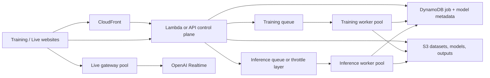
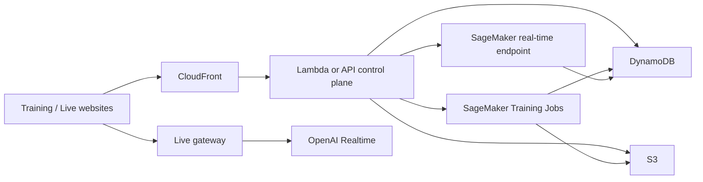

# Multi-User Readiness Assessment

> Based on the repository and deployment docs as of 2026-05-14.

## Short Answer

This project is **not yet truly multi-user ready** for production voice training and cloned-voice inference.

It **is** already split in a useful way:

- The frontend can be deployed as separate Training and Live Fast websites.
- The Lambda layer is mostly acting like a stateless control plane.
- The live chatbot WebSocket layer is per-connection and is closer to multi-user safe than the GPU worker.

But the part that matters most for scale is still effectively **single-worker / shared-state**:

- one GPU EC2 instance in the current docs
- one shared `gpu-worker` process
- one shared GPT-SoVITS inference server
- one shared "currently loaded model" state
- one shared in-memory training state
- one shared in-memory inference state
- no user-scoped auth or storage boundaries
- no queue / scheduler / job database

So the current system is better described as:

**multi-page + partially multi-session**, but **not multi-tenant and not horizontally scalable as-is**.

---

## Current Verdict By Area

| Area | Current status | Verdict |
| --- | --- | --- |
| Separate training site and chatbot site | Already supported by `client/src/lib/appMode.js` and CloudFront deployment docs | Good |
| Lambda / Function URL shared by both sites | Fine in principle because Lambda is mostly stateless | Good |
| Live WebSocket sessions | `live-gateway` creates one OpenAI bridge per browser socket | Mostly okay |
| Concurrent training jobs | `gpu-worker/src/routes/training.js` rejects a second active training job | Not ready |
| Concurrent chatbot voice replies for different users | All users share one GPT-SoVITS inference server and one loaded weights pair | Not ready |
| Concurrent users loading different voice models | `gpu-worker/src/services/inferenceServer.js` stores only one active GPT and SoVITS weights pair | Not ready |
| Per-user data isolation | S3 keys are based on `expName` or generic paths, not `userId` / `voiceId` ownership | Not ready |
| Horizontal scaling behind ALB | Session progress and state live in worker memory, so scale-out would misroute jobs | Not ready |
| Queueing / backpressure | No queue system found in the repo | Not ready |
| Auth / authorization | The repo docs explicitly mark this as deferred | Not ready |

---

## Why It Is Not Multi-User Ready Yet

### 1. Training is explicitly single-job

In `gpu-worker/src/routes/training.js`, the worker returns `409` if a training session is already running.

That means:

- one user training blocks every other user
- separating the training website from the chatbot website does not remove this backend bottleneck

### 2. Chatbot voice inference is still a shared worker

The Live Fast chatbot still shares one GPT-SoVITS inference server on the current worker.

That means:

- different users still compete for the same GPU inference process
- the biggest bottleneck becomes model switching and shared capacity, not frontend separation

### 3. Model loading is global, not user-scoped

`gpu-worker/src/services/inferenceServer.js` keeps:

- `currentGPTWeights`
- `currentSoVITSWeights`

So when one user loads a different voice model, that changes the shared inference server for everyone using that worker.

This is the biggest reason the current chatbot inference is not safely multi-user, even if many people can open the website at once.

### 4. Session state is in memory

These modules all keep important execution state in process memory:

- `gpu-worker/src/services/trainingState.js`
- `gpu-worker/src/services/inferenceState.js`
- `gpu-worker/src/services/sseManager.js`
- `gpu-worker/src/services/processManager.js`

This works on one worker instance, but it becomes a problem the moment you scale out.

If you add more GPU instances behind the ALB:

- the `POST /train` request may hit worker A
- the browser SSE request may hit worker B
- `GET /train/current` may hit worker C

Those workers do not share session memory, so progress, cancellation, current state, and result lookup can all break.

### 5. Storage is not user-isolated

Today the project uses paths like:

- `training/datasets/{expName}/...`
- `models/user-models/gpt/...`
- `models/user-models/sovits/...`
- `audio/reference/...`
- `audio/output/{sessionId}/final.wav`

Problems with this:

- `expName` is acting like both a display name and a storage identifier
- there is no clear `userId`, `tenantId`, `voiceId`, or `modelVersionId`
- ownership is not enforced in the application layer
- `GET /api/ref-audio?filePath=...` and training-audio listing are not tied to authenticated ownership

The repo's own S3 design notes already say the following are deferred:

- multi-tenant S3 key isolation
- database for metadata
- authentication / authorization
- GPU worker auto-scaling or queue management

So the project itself already documents that it is still single-tenant in spirit.

### 6. There is no queue system

There is no SQS, Redis queue, RabbitMQ, or equivalent job dispatcher in the current repo.

That means:

- bursts are not smoothed
- retries are weak
- capacity is not scheduled intentionally
- "busy" just turns into `409`, timeouts, or user waiting

### 7. The current deployment is still one shared GPU machine

`docs/lambda-serverless-gpu-worker-guide.md` describes the current setup as:

- one GPU EC2
- one public GPU ALB
- one `gpu-worker`
- one `live-gateway`

That is a valid first deployment, but it is still a single shared execution box.

---

## What Is Already Good

There is a lot here that is worth keeping.

- `lambda/` is already a useful control-plane boundary.
- `live-gateway/` is already separated from the main worker.
- `docs/containerization-images-split.md` already defines container images for Lambda, GPU worker, and live gateway.
- S3 is already being used as an artifact store, which is the right direction.
- The frontend split is already compatible with a future multi-service backend.

So this is not a bad architecture. It is just at the **single-team / small-beta** stage, not the **shared production multi-user** stage.

---

## The Code Structure Changes To Make First

Before cloud auto scaling, the code structure should change so the backend stops behaving like one shared machine.

### Recommended next structure

```text
apps/
  training-web/
  live-web/

services/
  api-control-plane/      # current lambda responsibilities
  live-gateway/           # current live-gateway

workers/
  training-worker/
  inference-worker/

shared/
  contracts/
  auth/
  storage/
  jobs/
  models/

infra/
  ecs/
  sagemaker/
  aws/
```

### Responsibility split

| Part | What it should own |
| --- | --- |
| `training-web` | Upload dataset, submit training job, show progress, list finished voices |
| `live-web` | OpenAI realtime chat, cloned-voice playback, voice selection |
| `api-control-plane` | Auth, request validation, create jobs, read job status, generate signed URLs |
| `training-worker` | Run one training job at a time per GPU worker |
| `inference-worker` | Serve low-latency cloned-voice TTS for the Live Fast chatbot |
| `shared/contracts` | Common job payload shapes, API schemas, event formats |
| `shared/storage` | S3 key builders and ownership-safe object paths |
| `shared/jobs` | Queue payloads, job states, retry rules |
| `shared/models` | Voice registry, model version metadata, cache rules |

### Identity model that should replace `expName` as the primary key

Keep `expName` only as a human-readable label.

Add real identifiers:

- `userId`
- `voiceId`
- `trainingJobId`
- `inferenceRequestId`
- `modelVersionId`

Example S3 layout:

```text
tenants/{tenantId}/users/{userId}/voices/{voiceId}/training/raw/{file}
tenants/{tenantId}/users/{userId}/voices/{voiceId}/training/denoised/{file}
tenants/{tenantId}/users/{userId}/voices/{voiceId}/models/{modelVersionId}/gpt.ckpt
tenants/{tenantId}/users/{userId}/voices/{voiceId}/models/{modelVersionId}/sovits.pth
```

If you are single-organization and do not need multi-tenant SaaS, you can drop `tenantId` and start with:

```text
users/{userId}/voices/{voiceId}/...
```

### Replace in-memory job state with persistent job state

Create a metadata store, usually DynamoDB for this kind of system.

Recommended tables:

| Table | Purpose |
| --- | --- |
| `Users` | User profile and auth linkage |
| `VoiceProfiles` | One row per voice / experiment |
| `TrainingJobs` | Submitted, queued, running, failed, complete |
| `ModelVersions` | Output artifact paths and active model metadata |
| `InferenceRequests` | Optional request logs, rate limiting, and troubleshooting data |
| `WorkerLeases` | Optional worker ownership / routing / heartbeat |

### Move from "proxy to one worker" to "submit a job"

Today Lambda mostly forwards requests directly to the worker.

For multi-user, the pattern should become:

1. API validates the request and checks auth.
2. API writes a job row to DynamoDB.
3. API pushes a message to a queue or starts a managed training job.
4. Worker picks the job up.
5. Worker writes progress back to DynamoDB and CloudWatch.
6. Browser polls job status or receives streamed events from a stable API layer.

That is the most important architecture shift.

---

## Do You Need A Queue System?

Yes, for training definitely.

For this project, the queue answer is:

- **Training:** yes, mandatory
- **Short live chatbot phrase TTS:** maybe not a visible queue, but you still need throttling, worker pools, and admission control

### Why training needs a queue

Training jobs are:

- long-running
- expensive
- GPU-heavy
- easy to overwhelm if multiple users click Start

Without a queue, your only choices are:

- reject requests
- overload the worker
- let jobs interfere

### Good queue choices

| Need | Good fit |
| --- | --- |
| Simple AWS-native job queue | SQS + DynamoDB |
| Managed workflow around training lifecycle | Step Functions + DynamoDB + SQS |
| Real-time worker coordination | Redis / ElastiCache, if needed later |

For the current project, **SQS + DynamoDB** is the cleanest first step.

---

## Important Warning About "Just Add More EC2s Behind The ALB"

Do **not** simply autoscale the current `gpu-worker` behind the existing ALB and call it multi-user ready.

That would fail because:

- session progress lives in worker memory
- SSE clients are stored in `sseManager`
- current training state lives in `trainingState`
- current inference state lives in `inferenceState`
- current loaded weights live in `inferenceServer`

Even ALB stickiness is not enough by itself, because:

- browser SSE traffic and Lambda server-to-server traffic are different clients
- job creation and job progress requests may not share the same sticky context

So horizontal scale requires **shared job state and explicit routing**, not only an ALB.

---

## Option 1: Containerized GPU Workers on EC2 or ECS

This is the closest path to your current codebase.

You already have a strong start because `docs/containerization-images-split.md` defines:

- `voice-gpu-worker`
- `voice-lambda-api`
- `voice-live-gateway`

### Best version of this option

Do not keep one combined GPU worker role forever.

Split it into:

- `training-worker` image
- `inference-worker` image
- `live-gateway` image

You can still build them from one shared GPT-SoVITS base image.

### Target architecture



### How this would work

1. Build versioned Docker images and push them to ECR.
2. Run workers either:
   - on GPU EC2 instances managed by an Auto Scaling Group, or
   - on ECS with GPU-capable EC2 container instances
3. Submit training jobs into SQS.
4. Let training workers poll the queue and process one training job per GPU slot.
5. Keep inference workers as a warm pool for low-latency chatbot voice generation.
6. Record progress and ownership in DynamoDB instead of worker memory.
7. Keep `live-gateway` separate because it is network-session oriented, not training oriented.

### Where ECS fits

AWS ECS supports GPU workloads on GPU-backed EC2 container instances. That makes ECS a good fit if you want:

- versioned container deployments
- easier rollouts
- better separation between services
- less host-level manual management than raw EC2

### Auto scaling signals for this option

Training worker scale:

- SQS queue depth
- average wait time in queue
- number of running jobs

Inference worker scale:

- request latency
- GPU utilization
- in-flight request count
- async backlog size

### Pros

- closest to your existing code and deployment docs
- easiest path to reuse current Node.js worker code
- most flexible for custom GPT-SoVITS behavior
- easiest to keep low-latency chatbot inference

### Cons

- you manage more infrastructure yourself
- you still need to design model cache and routing carefully
- training and inference scheduling is your responsibility

### When to choose this

Choose this if you want the fastest practical migration from the current repo without a big platform rewrite.

---

## Option 2: SageMaker-Based Approach

This option makes the most sense if you want managed training and are willing to adapt the worker flow to SageMaker job patterns.

### What SageMaker is good at here

AWS SageMaker supports:

- managed training jobs that write model artifacts to S3
- real-time inference endpoints for low-latency workloads

That maps well to your project, but only if you split the use cases correctly.

### SageMaker architecture pattern



### How to use SageMaker well for this project

| Workload | Best SageMaker fit |
| --- | --- |
| Voice model training | SageMaker Training Jobs |
| Short chatbot phrase TTS | SageMaker real-time endpoint, if latency is acceptable |

### Strengths

- managed training lifecycle
- clean job model
- easier separation between training and inference compute
- built-in support for artifact output to S3

### Weaknesses

- GPT-SoVITS will need a custom SageMaker-compatible container
- a live chatbot with model switching can be awkward on shared endpoints
- if every user needs their own loaded voice model at low latency, endpoint strategy becomes more complex and more expensive
- live WebSocket conversation still remains a separate service

### Fix for model switching on shared endpoints

Yes, there is a fix, but it should be treated as a routing and caching problem, not just an endpoint problem.

The best patterns are:

- **Model-pinned warm workers:** keep each inference worker or endpoint pinned to one `modelVersionId`, then route each chatbot request to a worker that already has that model loaded.
- **Warm pool + fallback loading:** keep the most popular voices warm, and send less common voices to a smaller load-on-demand pool that accepts some cold-start delay.
- **Per-voice capacity tiers:** give high-traffic voices dedicated capacity, while long-tail voices share a general pool.

For this project, the best fix is usually:

1. Keep a registry in DynamoDB of which worker has which `modelVersionId` loaded.
2. Route requests to an already warm worker when possible.
3. If no worker is warm, assign one worker to load the model and mark it busy during the load.
4. Reuse that worker for later requests until it is evicted by an LRU or TTL policy.

This avoids the worst-case behavior where every short chatbot reply pays a full model reload penalty.

### When to choose this

Choose this if your biggest pain is training operations and you want AWS to manage more of the lifecycle.

---

## Hybrid Option: SageMaker For Training, Smaller GPU Fleet For Inference

This is the option I would recommend most strongly for your project.

It matches your idea well:

- training is expensive, bursty, and long-running
- chatbot inference is the user-facing path that should stay fast and comparatively cheaper

### Recommended hybrid split

| Layer | Recommended platform |
| --- | --- |
| Training jobs | SageMaker Training Jobs |
| Live chatbot WebSocket | `live-gateway` on EC2 or ECS |
| Short cloned-voice inference | Small always-on GPU inference pool on EC2 or ECS |
| Control plane | Lambda or containerized API service |
| Metadata | DynamoDB |
| Storage | S3 |

### Why this hybrid is strong

- training spikes do not hurt chatbot latency
- inference can stay warm and low-latency
- you only pay big training costs when users actually train
- you can optimize inference separately for cost

### About your "use g4 to reduce cost" idea

This is a good idea to test, but it should be benchmarked rather than assumed.

From current AWS docs:

- `g4dn` uses NVIDIA T4 with **16 GiB** GPU memory
- `g5` uses NVIDIA A10G with **22 GiB** GPU memory
- `g6` uses NVIDIA L4 with **22 GiB** GPU memory

So the decision is not only about price. It is also about:

- whether your inference container fits comfortably in memory
- whether one loaded voice model is enough, or you need a small preloaded pool
- whether latency stays acceptable under concurrent usage

### Practical recommendation on instance families

Use this ranking for evaluation:

1. `g4dn` if the model fits comfortably and latency is acceptable
2. `g5` if you need more headroom than `g4dn`
3. `g6` if it benchmarks best for your specific GPT-SoVITS inference profile

I would not move inference from `g6` to `g4dn` until you measure:

- model load time
- p50 / p95 short TTS latency
- memory headroom
- max safe concurrent requests
- failure rate under load

---

## What You Need No Matter Which Cloud Option You Choose

### 1. Authentication and ownership

Add a real auth layer, such as Cognito or another identity provider, and attach every request to:

- `userId`
- optional `tenantId`

Then enforce ownership on:

- dataset upload
- model listing
- model loading
- training-audio browsing
- ref-audio URLs
- inference results

### 2. Stable metadata store

Use DynamoDB to store:

- job state
- model registry
- voice ownership
- progress summaries
- worker assignment if needed

### 3. Queue / scheduler

Use at least:

- one training queue
- one throttling / admission-control layer for live chatbot inference

### 4. Model registry

Do not treat the filesystem or S3 folder listing as the full source of truth forever.

Track:

- voice profile
- owner
- active model version
- training completion time
- artifact paths
- deployment readiness

### 5. Worker routing

You need a strategy for this question:

**Which worker owns this job or already has this model loaded?**

Possible answers:

- route by job assignment in DynamoDB
- route by `modelVersionId` to a worker that already has that voice loaded
- keep model-specific worker pools
- load on demand with cache and accept warm-up cost
- create short-lived per-job workers for training

### 6. Progress streaming

Move away from "worker memory is the progress API."

Use:

- DynamoDB status polling
- WebSocket events from a stable gateway
- or a pub/sub layer like Redis if you need real-time fan-out later

### 7. Observability

You will need:

- CloudWatch logs and metrics
- alarms for queue depth and worker failures
- job-level tracing by `trainingJobId` and request-level tracing by `inferenceRequestId`

---

## Suggested Rollout Plan

### Phase 1: Make the current architecture safe for a shared beta

- Add auth
- Add `userId` and `voiceId`
- Change S3 key structure
- Add DynamoDB metadata tables
- Stop using `expName` as the primary identity

### Phase 2: Decouple execution from the current single worker

- Split training and inference worker roles
- Add SQS for training jobs
- Persist job progress outside worker memory
- Keep the current single GPU instance if needed during migration

### Phase 3: Pick the cloud execution model

- Containerized EC2 or ECS if you want the shortest path from current code
- SageMaker training if you want managed training lifecycle
- Hybrid if you want the best balance of cost and user experience

### Phase 4: Load test before calling it multi-user ready

Test at least:

- 5 to 20 simultaneous live chat sessions
- multiple users selecting different voice models
- training job submission burst
- inference burst during one active training job
- worker restart during active jobs

---

## My Recommendation

If the goal is the most realistic next step from this repo, I would recommend:

1. Keep the split websites.
2. Keep Lambda as the control plane for now.
3. Add auth, DynamoDB metadata, and SQS.
4. Split GPU execution into separate training and inference worker roles.
5. Put training onto SageMaker Training Jobs or a dedicated training queue.
6. Keep chatbot inference on a smaller dedicated GPU pool.
7. Benchmark `g4dn` vs `g5` vs current `g6` before deciding the cheaper inference target.

If you want the simplest summary:

- **Current state:** good split architecture, but still single-worker at the GPU layer
- **Not multi-user ready yet:** because training, model loading, and progress state are shared
- **Best long-term design:** queue + metadata DB + per-user IDs + separated training and inference compute
- **Best practical cloud path:** SageMaker for training, smaller GPU fleet for inference

---

## Useful References

- Repo deployment docs:
  - `docs/lambda-serverless-gpu-worker-guide.md`
- `docs/containerization-images-split.md`
- `CLOUD_FRONTEND_FLOW_README.md`
- AWS official docs:
  - EC2 accelerated instance families: https://docs.aws.amazon.com/ec2/latest/instancetypes/ac.html
  - ECS GPU workloads: https://docs.aws.amazon.com/AmazonECS/latest/developerguide/ecs-gpu.html
  - SageMaker inference options: https://docs.aws.amazon.com/sagemaker/latest/dg/deploy-model-options.html
  - SageMaker training output behavior: https://docs.aws.amazon.com/sagemaker/latest/dg/your-algorithms-training-algo-output.html
