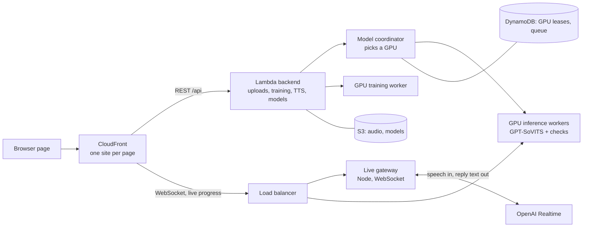

# Voice Cloning Platform — System Overview

Last updated: 2026-10-06 · Audience: project supervisor

## Summary

The platform clones a lecturer's voice from recorded audio. It then uses that voice to read text
aloud, to answer students in a live chatbot, and to co-host events as an AI MC. It runs on AWS, on
GPU servers that scale up and down with demand. It is live on the staging environment today.

- **Voice quality:** each long-form passage is checked twice before it is played. Speech recognition
  checks that every word was said, and a voice-match check confirms it still sounds like the
  speaker. Failed audio is regenerated, up to 5 tries per chunk.
- **Live conversation:** on the Live MC page, the speaker's turn ends about 1.1–1.6 s after they stop
  talking, and the AI starts replying about 0.6 s later. A dropped connection reconnects in under 3 s.
- **Scaling:** GPUs are shared between users. A request goes to a GPU that already holds the right
  voice. New GPUs start only when real requests are waiting, and idle GPUs shut down on their own.
- **Engineering health:** about 1,350 automated tests pass across the five main components.

## What it does

All six pages are built from one codebase, and each is deployed as its own website.

| Page | Used by | What it does |
| --- | --- | --- |
| Training | Staff | Upload recordings of a speaker and train a voice model (GPT-SoVITS). |
| Text to Speech | Staff | Turn typed text into audio in the cloned voice. "Fast" and "full quality" modes, plus a pronunciation dictionary for medical terms. |
| Faculty | Staff | Choose which cloned voice and reference clips a lecture uses, then publish the choice. |
| GI chatbot (lectures) | Students | A video lecture with a chatbot that answers questions aloud in the lecturer's voice. Records learning signals for a supervisor dashboard. |
| Dean chatbot | Students, visitors | A spoken conversation with an AI in the Dean's cloned voice. |
| Live MC | Event audience | An AI co-host that listens on a microphone and replies in the Dean's voice. |

OpenAI's Realtime API provides the conversation: it understands speech and writes the replies. The
cloned voice is generated only on our own GPU servers. Voice models and recordings never leave our
AWS account.

## How a voice is made

### 1. Training (Training page)

Staff upload recordings of the speaker. A GPU training worker then runs a nine-step pipeline, and
the page shows each step's progress live:

1. **Slice audio:** split long recordings into short clips.
2. **Denoise:** remove background noise.
3. **Speech recognition:** transcribe each clip so the model learns which sounds go with which words.
4. **Text features:** convert the transcripts into phonemes, the units of pronunciation.
5. **HuBERT features:** extract the sound content of each clip.
6. **Speaker verification:** confirm every clip is the same person, so stray voices don't get into
   the model.
7. **Semantic features:** extract the tokens the model learns to predict.
8. **Train SoVITS:** the acoustic model that produces the voice's sound.
9. **Train GPT:** the model that predicts speech rhythm and intonation from text.

The trained models are saved to S3, and the GPU's local disk is cleaned afterwards. S3 is the single
source of truth, so any GPU can load any voice.

### 2. Reference clips

When speaking, the voice engine copies the style of a short "reference clip" of the real speaker.
The system picks the reference automatically. Clips 3–9 s long score highest, as do clips with
clean names and transcripts. Staff can override the choice.

### 3. Publishing (Faculty page)

Staff choose which voice and reference clips each lecture uses. Publishing freezes that exact
version (a snapshot of both model files and the references). Each conversation stays on its
snapshot, so changing the published voice never alters a conversation already in progress.
Publishing on staging also copies the snapshot to the dev environment.

## Architecture

| Component | Folder | Role |
| --- | --- | --- |
| Web client | `client/` | React pages, mic capture, audio playback |
| Backend | `lambda/` | Serverless REST API: uploads, training, model selection, text-to-speech requests, pronunciation dictionary, analytics |
| Model coordinator | `lambda/model-coordinator/` | Decides which GPU serves a request, when to switch a GPU's voice, and when to add a GPU |
| Inference worker | `gpu-inference-worker/` | Loads a voice, generates speech, and verifies it |
| Training worker | `gpu-worker/` | Trains new voice models, one job at a time |
| Live gateway | `live-gateway/` | Holds the browser's live connection to OpenAI Realtime, and prepares reply text for the voice engine |

Browsers only talk to CloudFront, so every page uses a single web address with no direct calls to
backend servers. REST calls go to Lambda. Live connections and progress streams go through the load
balancer to the GPU servers.

### A live chatbot turn, step by step

1. The browser streams microphone audio to the live gateway.
2. The gateway forwards it to OpenAI, which detects when the speaker has finished and writes a reply.
3. The gateway cleans the reply text for speech; for example, it writes numbers out as words.
   It then passes the text on sentence by sentence.
4. Each sentence is synthesised on a GPU in the cloned voice. It plays as soon as it is ready, while
   the next sentence is still being generated.
5. Each turn has a speed/quality trade-off. To shorten the wait, the first sentence of a reply skips
   verification. Every later sentence is verified, as is everything in full-quality mode.

### Sharing GPUs between users

Each GPU (AWS g6.xlarge) holds one voice at a time and runs two requests at once. The model
coordinator decides where each request goes:

1. **Route:** send it to a GPU that already holds the right voice and has a free slot. Older GPUs
   are filled first, so newer ones go idle and can shut down.
2. **Queue:** if those GPUs are busy, the request waits in a short queue, at most 2 per GPU. Requests
   in the queue are still served.
3. **Switch:** if no GPU holds the voice, an idle GPU holding a different voice is switched to it.
   A busy GPU is never switched.
4. **Scale:** a new GPU starts only when real requests are waiting and no GPU can be switched.
   Selecting a voice in a menu never starts a GPU on its own.
5. **Scale in:** GPUs with no traffic for 15 minutes shut down, newest first.

A short lock in DynamoDB makes these decisions one at a time, so two simultaneous requests can't
both pick the same GPU. For events, a minimum number of GPUs can be reserved for the event voice.

## Voice quality safeguards

The voice engine sometimes skips or clips a word, which matters most for medical vocabulary.
Several checks catch this before audio reaches a listener:

| Safeguard | What it catches | How |
| --- | --- | --- |
| Word check | Skipped or half-said words | Whisper speech recognition transcribes each chunk. The chunk fails if under 80% of words are heard, or if a long word is heard faintly or too briefly. Full-quality mode uses the more accurate large-v3 model. |
| Voice-match check | Takes that drift away from the speaker's voice | A speaker-embedding model (resemblyzer) compares each take with the reference clip. |
| Best-of-N retries | Random bad takes | Up to 5 takes per chunk with the same voice settings; only the random seed changes. The first take that passes both checks is used. Otherwise the most complete one is kept. |
| Last-resort split | One word that keeps failing | The chunk is cut into smaller pieces so the problem word can be generated alone. |
| Pronunciation dictionary | Mispronounced terms | Staff add pronunciations through an admin panel, with CSV import and export. A curated list of medical terms is synced automatically from a free dictionary service. |

Design choices behind the checks:

- **Retries keep the voice the same.** An earlier approach lowered quality settings to recover a
  missed word, which made the voice sound less like the speaker. It was replaced by best-of-N.
- **Tuned on real data.** Production logs showed the word check rejecting good audio. Dictionary
  word splits (e.g. "endoscopy") and trial codes caused it. The matching was fixed to accept these.
- **Checks never block audio.** If a checking service is unavailable, synthesis goes ahead without it.

## Live MC (newest work, October 2026)

Live MC was built for live events, where people pause mid-sentence and there is room noise.
Choices were made by measurement rather than guesswork:

- **Turn ending:** a benchmark script compared OpenAI's two ways of deciding when someone has finished.
  - "Semantic" detection waited 3–5 s in the worst cases.
  - Silence-based detection ended turns in 1.29–1.37 s every time. It also handled 0.5–0.7 s pauses
    mid-sentence without cutting the speaker off.
  - Live MC uses silence-based detection.
- **Transcription:** each turn is shown as a transcript bubble on screen.
  - `gpt-4o-transcribe` had a 5.6% word error rate on quiet speech with background noise.
    `gpt-4o-mini-transcribe` had 12.9%.
  - Giving the transcriber earlier conversation as context made it repeat old turns, so that feature
    was removed.
- **Background talkers:** raising the speech threshold from 0.5 to 0.8 cut false turns from 6 to 2.
  A soft speaker was still detected.
- **Host controls:** sliders set noise filtering (Off to Max) and pause length (0.4–1.5 s, default
  0.7 s). Settings are saved per browser and apply from the next session.
- **Microphone capture:** capture was rebuilt to run in a background audio thread, so a busy page
  can't drop audio. It also has proper resampling; the old method distorted audio recorded at
  44.1 kHz.
- **Two modes:**
  - Turn-based: the mic closes while the AI speaks, and the AI always finishes its reply.
  - Continuous: the mic stays open, and the speaker can interrupt the AI mid-reply. If the
    speaker pauses and then continues, the half-ready reply is dropped and the full thought is
    answered.
- **Clear status:** the screen shows Listening, Hearing you, Replying, Speaking, or Muted, with a
  live mic level meter.
- **Reliability:**
  - A dropped connection reconnects automatically with backoff (1, 2, 4, 8 s, up to 10 tries).
    It resends the recent conversation, so the AI keeps its context.
  - A 40-minute soak test answered 6 of 6 turns, each in under 1.1 s.

## How good it is

| Area | Evidence | Verdict |
| --- | --- | --- |
| Automated tests | Client 519, gateway 184, backend 335, inference worker 259, coordinator 54; all pass | Strong |
| GPU routing and scaling | Verified live on 2026-08-31 and 2026-09-01: routing to a GPU with the right voice, queueing, one GPU added for overflow, and scale-in from 5 GPUs to 1 | Works as designed |
| Voice accuracy | Word and voice-match checks on every full-quality chunk; false alarms on medical terms fixed using production logs | Good |
| Live MC responsiveness | Turn ends 1.1–1.6 s after speech, reply about 0.6 s later, reconnect under 3 s | Good |
| Live MC transcription | 5.6% word error rate on quiet speech with background noise | Good |

**Overall:** the core voice cloning and staff tools are mature and well tested. The live
conversation features respond quickly and are tuned from measured benchmarks.

## Environments and deployment

| Environment | Purpose | GPUs |
| --- | --- | --- |
| Staging | The main environment. Staff author voices here via Faculty; it hosts Live MC. | Autoscaling group, from 1 up to 192 GPUs |
| Dev | Receives published voices for testing | Fixed GPU |

- **Hosting:** AWS Seoul (ap-northeast-2). Each page is served from S3 through its own CloudFront site.
- **One codebase:** dev and staging run the same code. Their differences live in configuration; for
  example, staging hides advanced settings.
- **Deployment:** PowerShell scripts in `scripts/` (`deploy-client.ps1`, `deploy-lambda.ps1`), plus
  `git pull` and a service restart on the GPU servers.
- **Smoke tests:** `scripts/test-staging-mc.mjs` for Live MC, and load-test scripts for the chatbot
  and text-to-speech.
